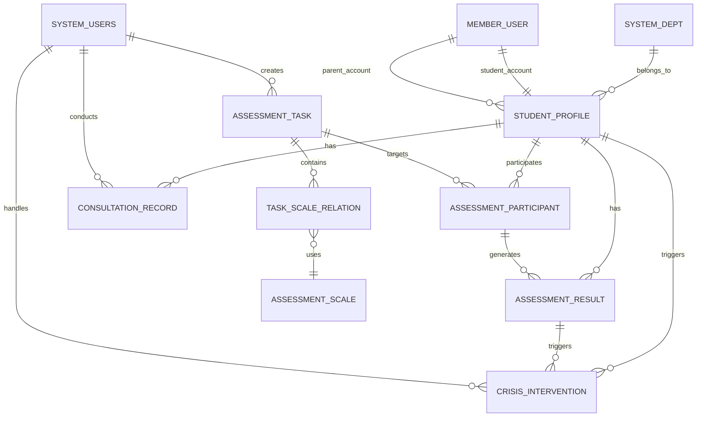

# 心理测评管理系统设计文档

## 概述

心理测评管理系统是对现有芋道教育管理系统的功能扩展，旨在为学校提供完整的学生心理健康评估和管理解决方案。系统采用模块化架构设计，与现有系统无缝集成，支持多端访问和多角色协作。

## 架构设计

### 系统架构

```mermaid
graph TB
    subgraph "前端层"
        A[管理端 - Vue3<br/>AdminUser访问]
        B[学生家长端 - H5<br/>MemberUser访问]
    end
    
    subgraph "API层"
        C[/admin-api/**<br/>管理端API]
        D[/app-api/**<br/>学生家长端API]
    end
    
    subgraph "业务层"
        E[yudao-module-psychology]
        F[yudao-module-system]
        G[yudao-module-infra]
    end
    
    subgraph "数据层"
        H[MySQL 8.0]
        I[Redis]
        J[文件存储]
    end
    
    A --> C
    B --> D
    C --> E
    D --> E
    E --> F
    E --> G
    E --> H
    E --> I
    E --> J
```

### 模块架构

基于现有系统的模块化设计，新增 `yudao-module-psychology` 模块：

```
yudao-module-psychology/
├── src/main/java/cn/iocoder/yudao/module/psychology/
│   ├── api/                    # 对外API接口
│   │   ├── assessment/         # 测评相关API
│   │   ├── profile/           # 档案相关API
│   │   └── consultation/      # 咨询相关API
│   ├── controller/            # 控制器层
│   │   ├── admin/             # 管理端控制器（AdminUser访问）
│   │   └── app/               # 学生家长端控制器（MemberUser访问）
│   ├── service/               # 业务逻辑层
│   │   ├── assessment/        # 测评服务
│   │   ├── profile/           # 档案服务
│   │   ├── consultation/      # 咨询服务
│   │   └── notification/      # 通知服务
│   ├── dal/                   # 数据访问层
│   │   ├── dataobject/        # 数据对象
│   │   └── mysql/             # MySQL映射器
│   ├── convert/               # 对象转换器
│   ├── enums/                 # 枚举类
│   └── framework/             # 框架配置
└── src/main/resources/
    └── mapper/                # MyBatis映射文件
```

## 数据模型设计

### 与现有系统的集成设计

#### 班级管理集成方案

基于现有的部门管理体系，我们将班级作为部门的子类型进行管理：

1. **复用现有表结构**：
   - `system_dept` 表：年级和班级都作为部门类型存储
   - `system_users` 表：教师用户信息
   - `member_user` 表：学生和家长用户信息

2. **扩展字段设计**：
   ```sql
   -- 扩展system_dept表，添加教育相关字段
   ALTER TABLE system_dept ADD COLUMN dept_type TINYINT DEFAULT 0 COMMENT '部门类型：0-普通部门，1-年级，2-班级';
   ALTER TABLE system_dept ADD COLUMN academic_year VARCHAR(20) COMMENT '学年（如：2024-2025）';
   ALTER TABLE system_dept ADD COLUMN grade_level TINYINT COMMENT '年级级别：1-高一，2-高二，3-高三';
   ALTER TABLE system_dept ADD COLUMN class_teacher_id BIGINT COMMENT '班主任ID';
   
   -- 示例数据
   INSERT INTO system_dept (name, parent_id, sort, leader_user_id, phone, email, status, dept_type, grade_level) VALUES
   ('高一年级', 1, 1, NULL, NULL, NULL, 1, 1, 1),
   ('高一(1)班', 上面插入的年级ID, 1, 班主任用户ID, NULL, NULL, 1, 2, 1),
   ('高一(2)班', 上面插入的年级ID, 2, 班主任用户ID, NULL, NULL, 1, 2, 1);
   ```

3. **权限管理集成**：
   - 复用现有的角色权限体系
   - 新增心理教师、班主任等角色
   - 通过数据权限控制不同角色的数据访问范围
   - 班主任自动获得所管理班级学生的数据权限

4. **教师班级关联**：
   ```sql
   -- 教师班级关联表（如果需要一个教师管理多个班级）
   CREATE TABLE psychology_teacher_class_relation (
       id BIGINT PRIMARY KEY AUTO_INCREMENT,
       teacher_id BIGINT NOT NULL COMMENT '教师ID（system_users表）',
       class_id BIGINT NOT NULL COMMENT '班级ID（system_dept表）',
       relation_type TINYINT NOT NULL COMMENT '关联类型：1-班主任，2-任课教师，3-心理教师',
       creator VARCHAR(64) DEFAULT '',
       create_time DATETIME DEFAULT CURRENT_TIMESTAMP,
       updater VARCHAR(64) DEFAULT '',
       update_time DATETIME DEFAULT CURRENT_TIMESTAMP ON UPDATE CURRENT_TIMESTAMP,
       deleted BIT(1) DEFAULT b'0',
       tenant_id BIGINT DEFAULT 0,
       
       UNIQUE KEY uk_teacher_class_type (teacher_id, class_id, relation_type),
       KEY idx_teacher_id (teacher_id),
       KEY idx_class_id (class_id)
   ) COMMENT='教师班级关联表';
   ```

#### 用户角色扩展

```sql
-- 在现有角色基础上新增心理相关角色
INSERT INTO system_role (name, code, sort, status, type, remark) VALUES
('心理教师', 'psychology_teacher', 10, 1, 2, '负责心理测评和咨询工作'),
('年级心理负责人', 'grade_psychology_manager', 11, 1, 2, '负责年级心理健康管理'),
('班主任', 'class_teacher', 12, 1, 2, '负责班级学生管理');
```

#### 固定问卷设计方案（第一期）

基于最新会议讨论，第一期系统采用固定问卷设计：

1. **固定问卷特性**：
   - **第一期问卷为写死（Hardcode）**：问卷内容固定在代码中，不支持后台编辑
   - **双套问卷设计**：第一期上线两套固定问卷
   - **单一问卷选择**：一次测评任务只能选择一个问卷
   - **任务ID系统**：每个测评任务生成唯一的任务ID/任务编号用于问题排查

2. **问卷分类管理**：
   - **学生问卷A**：学生心理健康基础评估问卷
   - **学生问卷B**：学生学习适应性评估问卷
   - 支持学生和家长分别参与测评
   - 家长信息与学生信息绑定，作为学生档案的一部分

3. **测评任务创建流程**：
   ```
   创建任务 → 选择学生 → 确认信息 → 发布
   ```
   - 步骤1：创建任务（设置基本信息，选择固定问卷）
   - 步骤2：选择学生（按年级批量、按班级精确、个体搜索）
   - 步骤3：确认信息（核对任务信息和目标学生）
   - 步骤4：发布任务（生成任务ID，发送通知）

4. **进度跟踪设计**：
   - **已完成**：学生已提交测评答案
   - **未开始**：学生尚未开始测评
   - **进行中**：学生已开始但未完成测评
   - 实时统计完成率和进度分布

5. **固定问卷示例数据**：
   ```sql
   -- 第一期固定问卷（写死在代码中）
   INSERT INTO psychology_assessment_scale (scale_name, scale_type, target_audience, scale_code, question_count, estimated_time, description, is_hardcoded) VALUES
   ('学生心理健康基础评估问卷', 1, 1, 'STUDENT_BASIC_A', 25, 15, '第一期固定学生问卷A', 1),
   ('学生学习适应性评估问卷', 1, 1, 'STUDENT_BASIC_B', 20, 12, '第一期固定学生问卷B', 1);
   
   -- 任务只能关联一个问卷
   INSERT INTO psychology_task_scale_relation (task_id, scale_id, sort_order, is_required) VALUES
   (1, 1, 1, 1); -- 一个任务只能选择一个问卷
   ```

### 核心实体关系图



### 数据表设计

#### 1. 学生档案表 (psychology_student_profile)

```sql
CREATE TABLE psychology_student_profile (
    id BIGINT PRIMARY KEY AUTO_INCREMENT COMMENT '档案ID',
    member_user_id BIGINT NOT NULL COMMENT '学生用户ID（关联member_user表）',
    parent_user_id BIGINT COMMENT '家长用户ID（关联member_user表）',
    student_name VARCHAR(50) NOT NULL COMMENT '学生姓名',
    student_no VARCHAR(50) NOT NULL COMMENT '学号',
    gender TINYINT NOT NULL COMMENT '性别：1-男，2-女',
    birth_date DATE NOT NULL COMMENT '出生日期',
    grade_id BIGINT NOT NULL COMMENT '年级ID',
    class_id BIGINT NOT NULL COMMENT '班级ID',
    phone VARCHAR(20) COMMENT '联系电话',
    address VARCHAR(200) COMMENT '家庭住址',
    psychological_status TINYINT DEFAULT 1 COMMENT '心理状态：1-正常，2-关注，3-预警，4-高危',
    graduation_status TINYINT DEFAULT 0 COMMENT '毕业状态：0-在校，1-已毕业',
    graduation_year INT COMMENT '毕业年份',
    graduation_session VARCHAR(20) COMMENT '毕业届别',
    psychological_treatment TINYINT COMMENT '心理处理方式：1-心理老师处理，2-毕业不再跟进',
    special_attention TEXT COMMENT '特殊关注标记',
    remarks TEXT COMMENT '备注说明',
    creator VARCHAR(64) DEFAULT '' COMMENT '创建者',
    create_time DATETIME DEFAULT CURRENT_TIMESTAMP COMMENT '创建时间',
    updater VARCHAR(64) DEFAULT '' COMMENT '更新者',
    update_time DATETIME DEFAULT CURRENT_TIMESTAMP ON UPDATE CURRENT_TIMESTAMP COMMENT '更新时间',
    deleted BIT(1) DEFAULT b'0' COMMENT '是否删除',
    tenant_id BIGINT DEFAULT 0 COMMENT '租户编号',
    
    UNIQUE KEY uk_student_no (student_no),
    UNIQUE KEY uk_member_user_id (member_user_id),
    KEY idx_parent_user_id (parent_user_id),
    KEY idx_class_id (class_id),
    KEY idx_psychological_status (psychological_status),
    KEY idx_graduation_status (graduation_status)
) COMMENT='学生心理档案表';
```

#### 2. 测评量表表 (psychology_assessment_scale)

```sql
CREATE TABLE psychology_assessment_scale (
    id BIGINT PRIMARY KEY AUTO_INCREMENT COMMENT '量表ID',
    scale_name VARCHAR(100) NOT NULL COMMENT '量表名称',
    scale_type TINYINT NOT NULL COMMENT '量表类型：1-初测，2-复测，3-主题测',
    target_audience TINYINT NOT NULL COMMENT '目标对象：1-学生，2-家长',
    scale_code VARCHAR(50) NOT NULL COMMENT '量表编码',
    question_count INT NOT NULL COMMENT '题目数量',
    estimated_time INT NOT NULL COMMENT '预计用时（分钟）',
    description TEXT COMMENT '量表描述',
    applicable_scope TEXT COMMENT '适用范围说明',
    scale_content JSON COMMENT '量表内容（题目、选项、计分规则）',
    sort_order INT DEFAULT 0 COMMENT '排序',
    status TINYINT DEFAULT 1 COMMENT '状态：1-启用，0-禁用',
    creator VARCHAR(64) DEFAULT '' COMMENT '创建者',
    create_time DATETIME DEFAULT CURRENT_TIMESTAMP COMMENT '创建时间',
    updater VARCHAR(64) DEFAULT '' COMMENT '更新者',
    update_time DATETIME DEFAULT CURRENT_TIMESTAMP ON UPDATE CURRENT_TIMESTAMP COMMENT '更新时间',
    deleted BIT(1) DEFAULT b'0' COMMENT '是否删除',
    tenant_id BIGINT DEFAULT 0 COMMENT '租户编号',
    
    UNIQUE KEY uk_scale_code (scale_code),
    KEY idx_scale_type (scale_type),
    KEY idx_target_audience (target_audience),
    KEY idx_sort_order (sort_order)
) COMMENT='心理测评量表表';
```

#### 3. 测评任务表 (psychology_assessment_task)

```sql
CREATE TABLE psychology_assessment_task (
    id BIGINT PRIMARY KEY AUTO_INCREMENT COMMENT '任务ID',
    task_code VARCHAR(50) NOT NULL COMMENT '任务编码',
    batch_name VARCHAR(100) NOT NULL COMMENT '批次名称',
    recipient_type TINYINT NOT NULL COMMENT '收件人类型：1-学生，2-家长',
    start_time DATETIME NOT NULL COMMENT '开始时间',
    end_time DATETIME NOT NULL COMMENT '结束时间',
    task_description TEXT COMMENT '任务描述',
    target_count INT DEFAULT 0 COMMENT '目标人数',
    completed_count INT DEFAULT 0 COMMENT '已完成人数',
    completion_rate DECIMAL(5,2) DEFAULT 0.00 COMMENT '完成率',
    status TINYINT DEFAULT 1 COMMENT '状态：1-进行中，2-已完成，3-已关闭',
    allow_makeup TINYINT DEFAULT 1 COMMENT '是否允许补测：1-允许，0-不允许',
    makeup_days INT DEFAULT 3 COMMENT '补测天数',
    notification_settings JSON COMMENT '通知设置',
    creator VARCHAR(64) DEFAULT '' COMMENT '创建者',
    create_time DATETIME DEFAULT CURRENT_TIMESTAMP COMMENT '创建时间',
    updater VARCHAR(64) DEFAULT '' COMMENT '更新者',
    update_time DATETIME DEFAULT CURRENT_TIMESTAMP ON UPDATE CURRENT_TIMESTAMP COMMENT '更新时间',
    deleted BIT(1) DEFAULT b'0' COMMENT '是否删除',
    tenant_id BIGINT DEFAULT 0 COMMENT '租户编号',
    
    UNIQUE KEY uk_task_code (task_code),
    KEY idx_status (status),
    KEY idx_create_time (create_time)
) COMMENT='心理测评任务表';
```

#### 3.1. 测评任务量表关联表 (psychology_task_scale_relation)

```sql
CREATE TABLE psychology_task_scale_relation (
    id BIGINT PRIMARY KEY AUTO_INCREMENT COMMENT '关联ID',
    task_id BIGINT NOT NULL COMMENT '任务ID',
    scale_id BIGINT NOT NULL COMMENT '量表ID',
    sort_order INT DEFAULT 0 COMMENT '量表顺序',
    is_required TINYINT DEFAULT 1 COMMENT '是否必填：1-必填，0-选填',
    creator VARCHAR(64) DEFAULT '' COMMENT '创建者',
    create_time DATETIME DEFAULT CURRENT_TIMESTAMP COMMENT '创建时间',
    updater VARCHAR(64) DEFAULT '' COMMENT '更新者',
    update_time DATETIME DEFAULT CURRENT_TIMESTAMP ON UPDATE CURRENT_TIMESTAMP COMMENT '更新时间',
    deleted BIT(1) DEFAULT b'0' COMMENT '是否删除',
    tenant_id BIGINT DEFAULT 0 COMMENT '租户编号',
    
    UNIQUE KEY uk_task_scale (task_id, scale_id),
    KEY idx_task_id (task_id),
    KEY idx_scale_id (scale_id),
    KEY idx_sort_order (sort_order)
) COMMENT='测评任务量表关联表';
```

#### 4. 测评任务参与者表 (psychology_assessment_participant)

```sql
CREATE TABLE psychology_assessment_participant (
    id BIGINT PRIMARY KEY AUTO_INCREMENT COMMENT '参与者ID',
    task_id BIGINT NOT NULL COMMENT '任务ID',
    student_id BIGINT NOT NULL COMMENT '学生ID',
    participant_type TINYINT NOT NULL COMMENT '参与者类型：1-学生本人，2-家长代答',
    completion_status TINYINT DEFAULT 0 COMMENT '完成状态：0-未开始，1-进行中，2-已完成',
    start_time DATETIME COMMENT '开始时间',
    submit_time DATETIME COMMENT '提交时间',
    completion_duration INT COMMENT '完成用时（分钟）',
    creator VARCHAR(64) DEFAULT '' COMMENT '创建者',
    create_time DATETIME DEFAULT CURRENT_TIMESTAMP COMMENT '创建时间',
    updater VARCHAR(64) DEFAULT '' COMMENT '更新者',
    update_time DATETIME DEFAULT CURRENT_TIMESTAMP ON UPDATE CURRENT_TIMESTAMP COMMENT '更新时间',
    deleted BIT(1) DEFAULT b'0' COMMENT '是否删除',
    tenant_id BIGINT DEFAULT 0 COMMENT '租户编号',
    
    UNIQUE KEY uk_task_student (task_id, student_id),
    KEY idx_task_id (task_id),
    KEY idx_student_id (student_id),
    KEY idx_completion_status (completion_status)
) COMMENT='测评任务参与者表';
```

#### 5. 测评结果表 (psychology_assessment_result)

```sql
CREATE TABLE psychology_assessment_result (
    id BIGINT PRIMARY KEY AUTO_INCREMENT COMMENT '结果ID',
    task_id BIGINT NOT NULL COMMENT '任务ID',
    student_id BIGINT NOT NULL COMMENT '学生ID',
    scale_id BIGINT NOT NULL COMMENT '量表ID',
    participant_type TINYINT NOT NULL COMMENT '参与者类型：1-学生本人，2-家长代答',
    total_score DECIMAL(8,2) COMMENT '总分',
    risk_level TINYINT NOT NULL COMMENT '风险等级：1-正常，2-关注，3-预警，4-高危',
    dimension_scores JSON COMMENT '各维度得分',
    answer_details JSON COMMENT '答题详情',
    risk_factors TEXT COMMENT '风险因素',
    professional_advice TEXT COMMENT '专业建议',
    report_content JSON COMMENT '完整报告内容',
    submit_time DATETIME NOT NULL COMMENT '提交时间',
    creator VARCHAR(64) DEFAULT '' COMMENT '创建者',
    create_time DATETIME DEFAULT CURRENT_TIMESTAMP COMMENT '创建时间',
    updater VARCHAR(64) DEFAULT '' COMMENT '更新者',
    update_time DATETIME DEFAULT CURRENT_TIMESTAMP ON UPDATE CURRENT_TIMESTAMP COMMENT '更新时间',
    deleted BIT(1) DEFAULT b'0' COMMENT '是否删除',
    tenant_id BIGINT DEFAULT 0 COMMENT '租户编号',
    
    UNIQUE KEY uk_task_student (task_id, student_id),
    KEY idx_student_id (student_id),
    KEY idx_risk_level (risk_level),
    KEY idx_submit_time (submit_time)
) COMMENT='心理测评结果表';
```

#### 6. 心理咨询记录表 (psychology_consultation_record)

```sql
CREATE TABLE psychology_consultation_record (
    id BIGINT PRIMARY KEY AUTO_INCREMENT COMMENT '咨询记录ID',
    student_id BIGINT NOT NULL COMMENT '学生ID',
    counselor_id BIGINT NOT NULL COMMENT '咨询师ID',
    consultation_type TINYINT NOT NULL COMMENT '咨询类型：1-个体咨询，2-个体访谈',
    appointment_time DATETIME COMMENT '预约时间',
    actual_time DATETIME COMMENT '实际咨询时间',
    duration INT COMMENT '咨询时长（分钟）',
    consultation_method TINYINT COMMENT '咨询方式：1-面对面，2-电话，3-视频',
    problem_types JSON COMMENT '问题类型标签',
    consultation_content TEXT COMMENT '咨询内容',
    counselor_notes TEXT COMMENT '咨询师记录',
    follow_up_plan TEXT COMMENT '后续计划',
    status TINYINT DEFAULT 1 COMMENT '状态：1-已预约，2-进行中，3-已完成，4-已取消',
    effectiveness_rating TINYINT COMMENT '效果评价：1-5分',
    creator VARCHAR(64) DEFAULT '' COMMENT '创建者',
    create_time DATETIME DEFAULT CURRENT_TIMESTAMP COMMENT '创建时间',
    updater VARCHAR(64) DEFAULT '' COMMENT '更新者',
    update_time DATETIME DEFAULT CURRENT_TIMESTAMP ON UPDATE CURRENT_TIMESTAMP COMMENT '更新时间',
    deleted BIT(1) DEFAULT b'0' COMMENT '是否删除',
    tenant_id BIGINT DEFAULT 0 COMMENT '租户编号',
    
    KEY idx_student_id (student_id),
    KEY idx_counselor_id (counselor_id),
    KEY idx_appointment_time (appointment_time),
    KEY idx_status (status)
) COMMENT='心理咨询记录表';
```

#### 7. 危机干预事件表 (psychology_crisis_intervention)

```sql
CREATE TABLE psychology_crisis_intervention (
    id BIGINT PRIMARY KEY AUTO_INCREMENT COMMENT '干预事件ID',
    student_id BIGINT NOT NULL COMMENT '学生ID',
    trigger_source TINYINT NOT NULL COMMENT '触发来源：1-测评结果，2-教师上报，3-AI检测',
    trigger_reference_id BIGINT COMMENT '触发来源关联ID',
    risk_level TINYINT NOT NULL COMMENT '风险等级：3-预警，4-高危',
    event_description TEXT COMMENT '事件描述',
    risk_factors TEXT COMMENT '风险因素',
    assigned_counselor_id BIGINT COMMENT '分配的咨询师ID',
    intervention_plan TEXT COMMENT '干预计划',
    intervention_actions JSON COMMENT '干预措施',
    current_status TINYINT DEFAULT 1 COMMENT '当前状态：1-待分配，2-处理中，3-已完成，4-已关闭',
    priority_level TINYINT DEFAULT 2 COMMENT '优先级：1-低，2-中，3-高，4-紧急',
    follow_up_required TINYINT DEFAULT 1 COMMENT '是否需要跟进：1-需要，0-不需要',
    resolution_notes TEXT COMMENT '处理结果说明',
    creator VARCHAR(64) DEFAULT '' COMMENT '创建者',
    create_time DATETIME DEFAULT CURRENT_TIMESTAMP COMMENT '创建时间',
    updater VARCHAR(64) DEFAULT '' COMMENT '更新者',
    update_time DATETIME DEFAULT CURRENT_TIMESTAMP ON UPDATE CURRENT_TIMESTAMP COMMENT '更新时间',
    deleted BIT(1) DEFAULT b'0' COMMENT '是否删除',
    tenant_id BIGINT DEFAULT 0 COMMENT '租户编号',
    
    KEY idx_student_id (student_id),
    KEY idx_assigned_counselor_id (assigned_counselor_id),
    KEY idx_risk_level (risk_level),
    KEY idx_current_status (current_status),
    KEY idx_create_time (create_time)
) COMMENT='危机干预事件表';
```

#### 8. 系统通知表 (psychology_notification)

```sql
CREATE TABLE psychology_notification (
    id BIGINT PRIMARY KEY AUTO_INCREMENT COMMENT '通知ID',
    notification_type TINYINT NOT NULL COMMENT '通知类型：1-测评任务，2-咨询预约，3-风险预警，4-系统消息',
    recipient_type TINYINT NOT NULL COMMENT '接收者类型：1-学生，2-家长，3-教师，4-管理员',
    recipient_id BIGINT NOT NULL COMMENT '接收者ID',
    title VARCHAR(200) NOT NULL COMMENT '通知标题',
    content TEXT NOT NULL COMMENT '通知内容',
    related_id BIGINT COMMENT '关联业务ID',
    send_channels JSON COMMENT '发送渠道：system-系统内，sms-短信，wechat-微信',
    send_status TINYINT DEFAULT 0 COMMENT '发送状态：0-待发送，1-已发送，2-发送失败',
    read_status TINYINT DEFAULT 0 COMMENT '阅读状态：0-未读，1-已读',
    send_time DATETIME COMMENT '发送时间',
    read_time DATETIME COMMENT '阅读时间',
    creator VARCHAR(64) DEFAULT '' COMMENT '创建者',
    create_time DATETIME DEFAULT CURRENT_TIMESTAMP COMMENT '创建时间',
    updater VARCHAR(64) DEFAULT '' COMMENT '更新者',
    update_time DATETIME DEFAULT CURRENT_TIMESTAMP ON UPDATE CURRENT_TIMESTAMP COMMENT '更新时间',
    deleted BIT(1) DEFAULT b'0' COMMENT '是否删除',
    tenant_id BIGINT DEFAULT 0 COMMENT '租户编号',
    
    KEY idx_recipient (recipient_type, recipient_id),
    KEY idx_notification_type (notification_type),
    KEY idx_send_status (send_status),
    KEY idx_read_status (read_status),
    KEY idx_create_time (create_time)
) COMMENT='系统通知表';
```

#### 9. 学生档案时间线表 (psychology_student_timeline)

```sql
CREATE TABLE psychology_student_timeline (
    id BIGINT PRIMARY KEY AUTO_INCREMENT COMMENT '时间线ID',
    student_id BIGINT NOT NULL COMMENT '学生ID',
    event_type TINYINT NOT NULL COMMENT '事件类型：1-档案创建，2-测评完成，3-咨询记录，4-危机干预，5-状态变更，6-家庭情况变更，7-毕业处理，8-快速上报',
    event_title VARCHAR(200) NOT NULL COMMENT '事件标题',
    event_description TEXT COMMENT '事件描述',
    event_data JSON COMMENT '事件详细数据',
    related_id BIGINT COMMENT '关联业务ID',
    related_type VARCHAR(50) COMMENT '关联业务类型',
    operator_id BIGINT COMMENT '操作人ID',
    operator_name VARCHAR(50) COMMENT '操作人姓名',
    operator_type TINYINT COMMENT '操作人类型：1-学生，2-家长，3-教师，4-管理员',
    event_time DATETIME NOT NULL COMMENT '事件发生时间',
    is_important TINYINT DEFAULT 0 COMMENT '是否重要事件：1-是，0-否',
    creator VARCHAR(64) DEFAULT '' COMMENT '创建者',
    create_time DATETIME DEFAULT CURRENT_TIMESTAMP COMMENT '创建时间',
    updater VARCHAR(64) DEFAULT '' COMMENT '更新者',
    update_time DATETIME DEFAULT CURRENT_TIMESTAMP ON UPDATE CURRENT_TIMESTAMP COMMENT '更新时间',
    deleted BIT(1) DEFAULT b'0' COMMENT '是否删除（时间线记录不允许删除）',
    tenant_id BIGINT DEFAULT 0 COMMENT '租户编号',
    
    KEY idx_student_id (student_id),
    KEY idx_event_type (event_type),
    KEY idx_event_time (event_time),
    KEY idx_operator_id (operator_id),
    KEY idx_is_important (is_important)
) COMMENT='学生档案时间线表（不可删除）';
```

#### 10. 快速上报记录表 (psychology_quick_report)

```sql
CREATE TABLE psychology_quick_report (
    id BIGINT PRIMARY KEY AUTO_INCREMENT COMMENT '上报记录ID',
    student_id BIGINT NOT NULL COMMENT '学生ID',
    reporter_id BIGINT NOT NULL COMMENT '上报人ID（教师）',
    report_title VARCHAR(200) NOT NULL COMMENT '上报标题',
    report_content TEXT NOT NULL COMMENT '上报内容描述',
    urgency_level TINYINT NOT NULL COMMENT '紧急程度：1-一般，2-关注，3-紧急，4-非常紧急',
    incident_time DATETIME COMMENT '事件发生时间',
    report_time DATETIME DEFAULT CURRENT_TIMESTAMP COMMENT '上报时间',
    status TINYINT DEFAULT 1 COMMENT '处理状态：1-待处理，2-处理中，3-已处理，4-已关闭',
    handler_id BIGINT COMMENT '处理人ID',
    handle_notes TEXT COMMENT '处理备注',
    handle_time DATETIME COMMENT '处理时间',
    follow_up_required TINYINT DEFAULT 1 COMMENT '是否需要跟进：1-需要，0-不需要',
    tags JSON COMMENT '标签（如：情绪异常、行为异常、学习问题等）',
    attachments JSON COMMENT '附件信息',
    creator VARCHAR(64) DEFAULT '' COMMENT '创建者',
    create_time DATETIME DEFAULT CURRENT_TIMESTAMP COMMENT '创建时间',
    updater VARCHAR(64) DEFAULT '' COMMENT '更新者',
    update_time DATETIME DEFAULT CURRENT_TIMESTAMP ON UPDATE CURRENT_TIMESTAMP COMMENT '更新时间',
    deleted BIT(1) DEFAULT b'0' COMMENT '是否删除',
    tenant_id BIGINT DEFAULT 0 COMMENT '租户编号',
    
    KEY idx_student_id (student_id),
    KEY idx_reporter_id (reporter_id),
    KEY idx_urgency_level (urgency_level),
    KEY idx_status (status),
    KEY idx_report_time (report_time),
    KEY idx_handler_id (handler_id)
) COMMENT='快速上报记录表';
```

## 组件和接口设计

### 核心服务组件

#### 1. 测评管理服务 (AssessmentService)

```java
@Service
public interface AssessmentService {
    
    // ========== 测评任务管理 ==========
    /**
     * 创建测评任务
     */
    Long createAssessmentTask(AssessmentTaskCreateReqVO createReqVO);
    
    /**
     * 获取测评任务列表
     */
    PageResult<AssessmentTaskRespVO> getAssessmentTaskPage(AssessmentTaskPageReqVO pageReqVO);
    
    /**
     * 获取测评任务详情
     */
    AssessmentTaskDetailRespVO getAssessmentTaskDetail(Long taskId);
    
    /**
     * 更新测评任务
     */
    void updateAssessmentTask(AssessmentTaskUpdateReqVO updateReqVO);
    
    /**
     * 关闭测评任务
     */
    void closeAssessmentTask(Long taskId, String reason);
    
    /**
     * 删除测评任务
     */
    void deleteAssessmentTask(Long taskId);
    
    /**
     * 发送测评提醒
     */
    void sendAssessmentReminder(Long taskId, List<Long> studentIds);
    
    /**
     * 延长测评时间
     */
    void extendAssessmentTime(Long taskId, LocalDateTime newEndTime);
    
    // ========== 测评参与 ==========
    /**
     * 获取用户的测评任务列表（学生或家长）
     */
    List<MyAssessmentTaskRespVO> getMyAssessmentTasks(Long userId, Integer userType);
    
    /**
     * 开始测评
     */
    AssessmentStartRespVO startAssessment(Long taskId, Long userId, Integer userType);
    
    /**
     * 保存测评答案（支持断点续答）
     */
    void saveAssessmentAnswers(Long taskId, Long userId, AssessmentAnswerSaveReqVO saveReqVO);
    
    /**
     * 提交测评
     */
    void submitAssessment(Long taskId, Long userId, AssessmentAnswerSubmitReqVO submitReqVO);
    
    /**
     * 获取测评进度
     */
    AssessmentProgressRespVO getAssessmentProgress(Long taskId, Long userId);
    
    // ========== 测评结果 ==========
    /**
     * 获取测评结果
     */
    AssessmentResultRespVO getAssessmentResult(Long taskId, Long studentId);
    
    /**
     * 获取测评结果列表
     */
    PageResult<AssessmentResultRespVO> getAssessmentResultPage(AssessmentResultPageReqVO pageReqVO);
    
    /**
     * 批量转入危机干预
     */
    void batchCreateCrisisIntervention(List<Long> studentIds, String reason);
    
    /**
     * 导出测评结果
     */
    byte[] exportAssessmentResults(Long taskId, List<Long> studentIds);
    
    // ========== 统计分析 ==========
    /**
     * 获取测评统计数据
     */
    AssessmentStatisticsRespVO getAssessmentStatistics(Long taskId);
    
    /**
     * 获取风险等级分布
     */
    List<RiskLevelDistributionRespVO> getRiskLevelDistribution(Long taskId);
    
    /**
     * 获取年级对比数据
     */
    List<GradeComparisonRespVO> getGradeComparison(Long taskId);
    
    /**
     * 获取班级对比数据
     */
    List<ClassComparisonRespVO> getClassComparison(Long taskId, Long gradeId);
}
```

#### 1.1. 测评量表服务 (AssessmentScaleService)

```java
@Service
public interface AssessmentScaleService {
    
    /**
     * 创建测评量表
     */
    Long createAssessmentScale(AssessmentScaleCreateReqVO createReqVO);
    
    /**
     * 更新测评量表
     */
    void updateAssessmentScale(AssessmentScaleUpdateReqVO updateReqVO);
    
    /**
     * 删除测评量表
     */
    void deleteAssessmentScale(Long scaleId);
    
    /**
     * 获取测评量表详情
     */
    AssessmentScaleRespVO getAssessmentScale(Long scaleId);
    
    /**
     * 获取测评量表列表
     */
    PageResult<AssessmentScaleRespVO> getAssessmentScalePage(AssessmentScalePageReqVO pageReqVO);
    
    /**
     * 获取可用的测评量表列表（按目标对象筛选）
     */
    List<AssessmentScaleSimpleRespVO> getAvailableScales(Integer targetAudience, Integer scaleType);
    
    /**
     * 启用/禁用量表
     */
    void updateScaleStatus(Long scaleId, Integer status);
}
```

#### 2. 学生档案服务 (StudentProfileService)

```java
@Service
public interface StudentProfileService {
    
    /**
     * 创建学生档案
     */
    Long createStudentProfile(StudentProfileCreateReqVO createReqVO);
    
    /**
     * 批量导入学生档案
     */
    StudentProfileImportRespVO importStudentProfiles(List<StudentProfileImportVO> importList);
    
    /**
     * 获取学生档案分页
     */
    PageResult<StudentProfileRespVO> getStudentProfilePage(StudentProfilePageReqVO pageReqVO);
    
    /**
     * 获取学生360°档案
     */
    StudentProfile360RespVO getStudentProfile360(Long studentId);
    
    /**
     * 更新学生心理状态
     */
    void updatePsychologicalStatus(Long studentId, Integer status, String reason);
    
    /**
     * 年级毕业处理
     */
    void graduateGrade(GradeGraduationReqVO graduationReqVO);
    
    /**
     * 改为就读状态
     */
    void changeToEnrolled(Long studentId, Long classId);
    
    /**
     * 导出学生档案
     */
    byte[] exportStudentProfile(Long studentId, List<String> exportTypes);
}
```

#### 3. 心理咨询服务 (ConsultationService)

```java
@Service
public interface ConsultationService {
    
    /**
     * 创建咨询预约
     */
    Long createConsultationAppointment(ConsultationAppointmentCreateReqVO createReqVO);
    
    /**
     * 获取咨询记录列表
     */
    PageResult<ConsultationRecordRespVO> getConsultationRecordPage(ConsultationRecordPageReqVO pageReqVO);
    
    /**
     * 更新咨询记录
     */
    void updateConsultationRecord(ConsultationRecordUpdateReqVO updateReqVO);
    
    /**
     * 上传咨询评估报告
     */
    void uploadConsultationReport(Long recordId, ConsultationReportUploadReqVO uploadReqVO);
    
    /**
     * 获取咨询统计数据
     */
    ConsultationStatisticsRespVO getConsultationStatistics(ConsultationStatisticsReqVO reqVO);
}
```

#### 4. 危机干预服务 (CrisisInterventionService)

```java
@Service
public interface CrisisInterventionService {
    
    /**
     * 创建危机干预事件
     */
    Long createCrisisIntervention(CrisisInterventionCreateReqVO createReqVO);
    
    /**
     * 获取危机干预事件列表
     */
    PageResult<CrisisInterventionRespVO> getCrisisInterventionPage(CrisisInterventionPageReqVO pageReqVO);
    
    /**
     * 分配处理人
     */
    void assignCounselor(Long interventionId, Long counselorId);
    
    /**
     * 更新干预状态
     */
    void updateInterventionStatus(Long interventionId, Integer status, String notes);
    
    /**
     * 自动风险检测
     */
    void autoRiskDetection(Long studentId, Integer riskLevel, String source);
}
```

### API接口设计

#### 1. 管理端API

```java
@RestController
@RequestMapping("/admin-api/psychology/assessment")
@Tag(name = "管理后台 - 心理测评管理")
public class AssessmentController {
    
    @PostMapping("/task/create")
    @Operation(summary = "创建测评任务")
    public CommonResult<Long> createAssessmentTask(@Valid @RequestBody AssessmentTaskCreateReqVO createReqVO);
    
    @GetMapping("/task/page")
    @Operation(summary = "获取测评任务分页")
    public CommonResult<PageResult<AssessmentTaskRespVO>> getAssessmentTaskPage(@Valid AssessmentTaskPageReqVO pageReqVO);
    
    @GetMapping("/task/detail/{id}")
    @Operation(summary = "获取测评任务详情")
    public CommonResult<AssessmentTaskDetailRespVO> getAssessmentTaskDetail(@PathVariable("id") Long id);
    
    @PostMapping("/task/close/{id}")
    @Operation(summary = "关闭测评任务")
    public CommonResult<Boolean> closeAssessmentTask(@PathVariable("id") Long id, @RequestBody AssessmentTaskCloseReqVO closeReqVO);
    
    @PostMapping("/result/batch-intervention")
    @Operation(summary = "批量转入危机干预")
    public CommonResult<Boolean> batchCreateCrisisIntervention(@Valid @RequestBody BatchCrisisInterventionReqVO reqVO);
}
```

#### 2. 学生家长端API

```java
@RestController
@RequestMapping("/app-api/psychology/assessment")
@Tag(name = "学生家长端 - 心理测评")
public class AppAssessmentController {
    
    @GetMapping("/task/my-list")
    @Operation(summary = "获取我的测评任务（学生）或孩子的测评任务（家长）")
    public CommonResult<List<MyAssessmentTaskRespVO>> getMyAssessmentTasks();
    
    @GetMapping("/task/detail/{id}")
    @Operation(summary = "获取测评任务详情")
    public CommonResult<AssessmentTaskDetailRespVO> getAssessmentTaskDetail(@PathVariable("id") Long id);
    
    @PostMapping("/start/{taskId}")
    @Operation(summary = "开始测评")
    public CommonResult<AssessmentStartRespVO> startAssessment(@PathVariable("taskId") Long taskId);
    
    @PostMapping("/save-answers/{taskId}")
    @Operation(summary = "保存测评答案（断点续答）")
    public CommonResult<Boolean> saveAssessmentAnswers(@PathVariable("taskId") Long taskId, 
                                                      @Valid @RequestBody AssessmentAnswerSaveReqVO saveReqVO);
    
    @PostMapping("/submit/{taskId}")
    @Operation(summary = "提交测评")
    public CommonResult<Boolean> submitAssessment(@PathVariable("taskId") Long taskId, 
                                                 @Valid @RequestBody AssessmentAnswerSubmitReqVO submitReqVO);
    
    @GetMapping("/progress/{taskId}")
    @Operation(summary = "获取测评进度")
    public CommonResult<AssessmentProgressRespVO> getAssessmentProgress(@PathVariable("taskId") Long taskId);
    
    @GetMapping("/result/{taskId}")
    @Operation(summary = "查看测评结果")
    public CommonResult<AssessmentResultRespVO> getAssessmentResult(@PathVariable("taskId") Long taskId);
    
    @GetMapping("/history")
    @Operation(summary = "获取历史测评记录")
    public CommonResult<List<AssessmentHistoryRespVO>> getAssessmentHistory();
}

@RestController
@RequestMapping("/app-api/psychology/profile")
@Tag(name = "学生家长端 - 心理档案")
public class AppStudentProfileController {
    
    @GetMapping("/my-profile")
    @Operation(summary = "获取我的心理档案（学生）或孩子的档案（家长）")
    public CommonResult<StudentProfileRespVO> getMyProfile();
    
    @GetMapping("/timeline")
    @Operation(summary = "获取心理档案时间线")
    public CommonResult<List<ProfileTimelineRespVO>> getProfileTimeline();
    
    @GetMapping("/assessment-history")
    @Operation(summary = "获取测评历史记录")
    public CommonResult<List<AssessmentHistoryRespVO>> getAssessmentHistory();
}
```

### 完整的管理端API接口

```java
// ========== 测评任务管理 ==========
@RestController
@RequestMapping("/admin-api/psychology/assessment/task")
@Tag(name = "管理后台 - 测评任务管理")
public class AssessmentTaskController {
    
    @PostMapping("/create")
    @Operation(summary = "创建测评任务")
    public CommonResult<Long> createAssessmentTask(@Valid @RequestBody AssessmentTaskCreateReqVO createReqVO);
    
    @GetMapping("/page")
    @Operation(summary = "获取测评任务分页")
    public CommonResult<PageResult<AssessmentTaskRespVO>> getAssessmentTaskPage(@Valid AssessmentTaskPageReqVO pageReqVO);
    
    @GetMapping("/detail/{id}")
    @Operation(summary = "获取测评任务详情")
    public CommonResult<AssessmentTaskDetailRespVO> getAssessmentTaskDetail(@PathVariable("id") Long id);
    
    @PutMapping("/update")
    @Operation(summary = "更新测评任务")
    public CommonResult<Boolean> updateAssessmentTask(@Valid @RequestBody AssessmentTaskUpdateReqVO updateReqVO);
    
    @PostMapping("/close/{id}")
    @Operation(summary = "关闭测评任务")
    public CommonResult<Boolean> closeAssessmentTask(@PathVariable("id") Long id, @RequestBody AssessmentTaskCloseReqVO closeReqVO);
    
    @DeleteMapping("/delete/{id}")
    @Operation(summary = "删除测评任务")
    public CommonResult<Boolean> deleteAssessmentTask(@PathVariable("id") Long id);
    
    @PostMapping("/send-reminder/{id}")
    @Operation(summary = "发送测评提醒")
    public CommonResult<Boolean> sendAssessmentReminder(@PathVariable("id") Long id, @RequestBody AssessmentReminderReqVO reminderReqVO);
    
    @PostMapping("/extend-time/{id}")
    @Operation(summary = "延长测评时间")
    public CommonResult<Boolean> extendAssessmentTime(@PathVariable("id") Long id, @RequestBody AssessmentExtendTimeReqVO extendReqVO);
    
    @GetMapping("/statistics/{id}")
    @Operation(summary = "获取测评统计数据")
    public CommonResult<AssessmentStatisticsRespVO> getAssessmentStatistics(@PathVariable("id") Long id);
    
    @GetMapping("/risk-distribution/{id}")
    @Operation(summary = "获取风险等级分布")
    public CommonResult<List<RiskLevelDistributionRespVO>> getRiskLevelDistribution(@PathVariable("id") Long id);
    
    @GetMapping("/grade-comparison/{id}")
    @Operation(summary = "获取年级对比数据")
    public CommonResult<List<GradeComparisonRespVO>> getGradeComparison(@PathVariable("id") Long id);
    
    @GetMapping("/class-comparison/{id}")
    @Operation(summary = "获取班级对比数据")
    public CommonResult<List<ClassComparisonRespVO>> getClassComparison(@PathVariable("id") Long id, @RequestParam(required = false) Long gradeId);
}

// ========== 测评量表管理 ==========
@RestController
@RequestMapping("/admin-api/psychology/assessment/scale")
@Tag(name = "管理后台 - 测评量表管理")
public class AssessmentScaleController {
    
    @PostMapping("/create")
    @Operation(summary = "创建测评量表")
    public CommonResult<Long> createAssessmentScale(@Valid @RequestBody AssessmentScaleCreateReqVO createReqVO);
    
    @PutMapping("/update")
    @Operation(summary = "更新测评量表")
    public CommonResult<Boolean> updateAssessmentScale(@Valid @RequestBody AssessmentScaleUpdateReqVO updateReqVO);
    
    @DeleteMapping("/delete/{id}")
    @Operation(summary = "删除测评量表")
    public CommonResult<Boolean> deleteAssessmentScale(@PathVariable("id") Long id);
    
    @GetMapping("/get/{id}")
    @Operation(summary = "获取测评量表详情")
    public CommonResult<AssessmentScaleRespVO> getAssessmentScale(@PathVariable("id") Long id);
    
    @GetMapping("/page")
    @Operation(summary = "获取测评量表分页")
    public CommonResult<PageResult<AssessmentScaleRespVO>> getAssessmentScalePage(@Valid AssessmentScalePageReqVO pageReqVO);
    
    @GetMapping("/available-list")
    @Operation(summary = "获取可用的测评量表列表")
    public CommonResult<List<AssessmentScaleSimpleRespVO>> getAvailableScales(@RequestParam Integer targetAudience, 
                                                                             @RequestParam(required = false) Integer scaleType);
    
    @PutMapping("/update-status/{id}")
    @Operation(summary = "启用/禁用量表")
    public CommonResult<Boolean> updateScaleStatus(@PathVariable("id") Long id, @RequestParam Integer status);
}

// ========== 测评结果管理 ==========
@RestController
@RequestMapping("/admin-api/psychology/assessment/result")
@Tag(name = "管理后台 - 测评结果管理")
public class AssessmentResultController {
    
    @GetMapping("/page")
    @Operation(summary = "获取测评结果分页")
    public CommonResult<PageResult<AssessmentResultRespVO>> getAssessmentResultPage(@Valid AssessmentResultPageReqVO pageReqVO);
    
    @GetMapping("/detail/{taskId}/{studentId}")
    @Operation(summary = "获取学生测评结果详情")
    public CommonResult<AssessmentResultRespVO> getAssessmentResult(@PathVariable("taskId") Long taskId, @PathVariable("studentId") Long studentId);
    
    @PostMapping("/batch-intervention")
    @Operation(summary = "批量转入危机干预")
    public CommonResult<Boolean> batchCreateCrisisIntervention(@Valid @RequestBody BatchCrisisInterventionReqVO reqVO);
    
    @PostMapping("/export")
    @Operation(summary = "导出测评结果")
    public void exportAssessmentResults(@Valid @RequestBody AssessmentResultExportReqVO exportReqVO, HttpServletResponse response);
}

// ========== 学生档案管理 ==========
@RestController
@RequestMapping("/admin-api/psychology/student-profile")
@Tag(name = "管理后台 - 学生档案管理")
public class StudentProfileController {
    
    @PostMapping("/create")
    @Operation(summary = "创建学生档案")
    public CommonResult<Long> createStudentProfile(@Valid @RequestBody StudentProfileCreateReqVO createReqVO);
    
    @PostMapping("/import")
    @Operation(summary = "批量导入学生档案")
    public CommonResult<StudentProfileImportRespVO> importStudentProfiles(@RequestParam("file") MultipartFile file);
    
    @GetMapping("/import-template")
    @Operation(summary = "下载导入模板")
    public void downloadImportTemplate(HttpServletResponse response);
    
    @GetMapping("/page")
    @Operation(summary = "获取学生档案分页")
    public CommonResult<PageResult<StudentProfileRespVO>> getStudentProfilePage(@Valid StudentProfilePageReqVO pageReqVO);
    
    @GetMapping("/360/{id}")
    @Operation(summary = "获取学生360°档案")
    public CommonResult<StudentProfile360RespVO> getStudentProfile360(@PathVariable("id") Long id);
    
    @PutMapping("/update-status")
    @Operation(summary = "更新学生心理状态")
    public CommonResult<Boolean> updatePsychologicalStatus(@Valid @RequestBody StudentStatusUpdateReqVO updateReqVO);
    
    @PostMapping("/graduate-grade")
    @Operation(summary = "年级毕业处理")
    public CommonResult<Boolean> graduateGrade(@Valid @RequestBody GradeGraduationReqVO graduationReqVO);
    
    @PostMapping("/change-to-enrolled/{id}")
    @Operation(summary = "改为就读状态")
    public CommonResult<Boolean> changeToEnrolled(@PathVariable("id") Long id, @RequestBody StudentEnrollReqVO enrollReqVO);
    
    @PostMapping("/export-profile/{id}")
    @Operation(summary = "导出学生档案")
    public void exportStudentProfile(@PathVariable("id") Long id, @RequestBody StudentProfileExportReqVO exportReqVO, HttpServletResponse response);
    
    @GetMapping("/graduated-students")
    @Operation(summary = "获取已毕业学生列表")
    public CommonResult<PageResult<GraduatedStudentRespVO>> getGraduatedStudents(@Valid GraduatedStudentPageReqVO pageReqVO);
}

// ========== 通知管理 ==========
@RestController
@RequestMapping("/admin-api/psychology/notification")
@Tag(name = "管理后台 - 通知管理")
public class NotificationController {
    
    @PostMapping("/send")
    @Operation(summary = "发送通知")
    public CommonResult<Boolean> sendNotification(@Valid @RequestBody NotificationSendReqVO sendReqVO);
    
    @GetMapping("/page")
    @Operation(summary = "获取通知分页")
    public CommonResult<PageResult<NotificationRespVO>> getNotificationPage(@Valid NotificationPageReqVO pageReqVO);
    
    @PutMapping("/mark-read/{id}")
    @Operation(summary = "标记通知为已读")
    public CommonResult<Boolean> markNotificationAsRead(@PathVariable("id") Long id);
}

// ========== 系统配置 ==========
@RestController
@RequestMapping("/admin-api/psychology/config")
@Tag(name = "管理后台 - 系统配置")
public class PsychologyConfigController {
    
    @GetMapping("/class-list")
    @Operation(summary = "获取班级列表")
    public CommonResult<List<ClassSimpleRespVO>> getClassList(@RequestParam(required = false) Long gradeId);
    
    @GetMapping("/grade-list")
    @Operation(summary = "获取年级列表")
    public CommonResult<List<GradeSimpleRespVO>> getGradeList();
    
    @GetMapping("/teacher-list")
    @Operation(summary = "获取教师列表")
    public CommonResult<List<TeacherSimpleRespVO>> getTeacherList(@RequestParam(required = false) String roleCode);
}
```

## 第一期MVP接口完整性分析

基于当前的接口设计，我认为已经能够满足第一期MVP的核心需求：

### ✅ 已覆盖的核心功能：

1. **测评任务管理**：
   - 创建、查询、更新、关闭、删除测评任务 ✅
   - 测评任务详情和统计分析 ✅
   - 发送提醒和延长时间 ✅

2. **测评量表管理**：
   - 量表的CRUD操作 ✅
   - 支持学生和家长不同量表 ✅
   - 量表状态管理 ✅

3. **测评参与功能**：
   - 学生家长获取测评任务 ✅
   - 开始测评、保存答案、提交测评 ✅
   - 断点续答和进度查询 ✅

4. **测评结果管理**：
   - 结果查询和详情展示 ✅
   - 批量转入危机干预 ✅
   - 结果导出功能 ✅

5. **学生档案管理**：
   - 档案创建、导入、查询 ✅
   - 360°档案展示 ✅
   - 毕业管理和状态更新 ✅

6. **基础支撑功能**：
   - 通知管理 ✅
   - 系统配置（班级、年级、教师） ✅

### 🔍 可能需要补充的接口：

让我补充一些可能遗漏的关键接口：/{id}")
    @Operation(summary = "发送测评提醒")
    public CommonResult<Boolean> sendAssessmentReminder(@PathVariable("id") Long id, @RequestBody AssessmentReminderReqVO reminderReqVO);
    
    @PostMapping("/extend-time/{id}")
    @Operation(summary = "延长测评时间")
    public CommonResult<Boolean> extendAssessmentTime(@PathVariable("id") Long id, @RequestBody AssessmentExtendTimeReqVO extendReqVO);
    
    @GetMapping("/statistics/{id}")
    @Operation(summary = "获取测评统计数据")
    public CommonResult<AssessmentStatisticsRespVO> getAssessmentStatistics(@PathVariable("id") Long id);
    
    @GetMapping("/risk-distribution/{id}")
    @Operation(summary = "获取风险等级分布")
    public CommonResult<List<RiskLevelDistributionRespVO>> getRiskLevelDistribution(@PathVariable("id") Long id);
    
    @GetMapping("/grade-comparison/{id}")
    @Operation(summary = "获取年级对比数据")
    public CommonResult<List<GradeComparisonRespVO>> getGradeComparison(@PathVariable("id") Long id);
    
    @GetMapping("/class-comparison/{id}")
    @Operation(summary = "获取班级对比数据")
    public CommonResult<List<ClassComparisonRespVO>> getClassComparison(@PathVariable("id") Long id, @RequestParam(required = false) Long gradeId);
}

// ========== 测评量表管理 ==========
@RestController
@RequestMapping("/admin-api/psychology/assessment/scale")
@Tag(name = "管理后台 - 测评量表管理")
public class AssessmentScaleController {
    
    @PostMapping("/create")
    @Operation(summary = "创建测评量表")
    public CommonResult<Long> createAssessmentScale(@Valid @RequestBody AssessmentScaleCreateReqVO createReqVO);
    
    @PutMapping("/update")
    @Operation(summary = "更新测评量表")
    public CommonResult<Boolean> updateAssessmentScale(@Valid @RequestBody AssessmentScaleUpdateReqVO updateReqVO);
    
    @DeleteMapping("/delete/{id}")
    @Operation(summary = "删除测评量表")
    public CommonResult<Boolean> deleteAssessmentScale(@PathVariable("id") Long id);
    
    @GetMapping("/get/{id}")
    @Operation(summary = "获取测评量表详情")
    public CommonResult<AssessmentScaleRespVO> getAssessmentScale(@PathVariable("id") Long id);
    
    @GetMapping("/page")
    @Operation(summary = "获取测评量表分页")
    public CommonResult<PageResult<AssessmentScaleRespVO>> getAssessmentScalePage(@Valid AssessmentScalePageReqVO pageReqVO);
    
    @GetMapping("/available-list")
    @Operation(summary = "获取可用的测评量表列表")
    public CommonResult<List<AssessmentScaleSimpleRespVO>> getAvailableScales(@RequestParam Integer targetAudience, 
                                                                             @RequestParam(required = false) Integer scaleType);
    
    @PutMapping("/update-status/{id}")
    @Operation(summary = "启用/禁用量表")
    public CommonResult<Boolean> updateScaleStatus(@PathVariable("id") Long id, @RequestParam Integer status);
}

// ========== 测评结果管理 ==========
@RestController
@RequestMapping("/admin-api/psychology/assessment/result")
@Tag(name = "管理后台 - 测评结果管理")
public class AssessmentResultController {
    
    @GetMapping("/page")
    @Operation(summary = "获取测评结果分页")
    public CommonResult<PageResult<AssessmentResultRespVO>> getAssessmentResultPage(@Valid AssessmentResultPageReqVO pageReqVO);
    
    @GetMapping("/detail/{taskId}/{studentId}")
    @Operation(summary = "获取学生测评结果详情")
    public CommonResult<AssessmentResultRespVO> getAssessmentResult(@PathVariable("taskId") Long taskId, @PathVariable("studentId") Long studentId);
    
    @PostMapping("/batch-intervention")
    @Operation(summary = "批量转入危机干预")
    public CommonResult<Boolean> batchCreateCrisisIntervention(@Valid @RequestBody BatchCrisisInterventionReqVO reqVO);
    
    @PostMapping("/export")
    @Operation(summary = "导出测评结果")
    public void exportAssessmentResults(@Valid @RequestBody AssessmentResultExportReqVO exportReqVO, HttpServletResponse response);
}

// ========== 学生档案管理 ==========
@RestController
@RequestMapping("/admin-api/psychology/student-profile")
@Tag(name = "管理后台 - 学生档案管理")
public class StudentProfileController {
    
    @PostMapping("/create")
    @Operation(summary = "创建学生档案")
    public CommonResult<Long> createStudentProfile(@Valid @RequestBody StudentProfileCreateReqVO createReqVO);
    
    @PostMapping("/import")
    @Operation(summary = "批量导入学生档案")
    public CommonResult<StudentProfileImportRespVO> importStudentProfiles(@RequestParam("file") MultipartFile file);
    
    @GetMapping("/import-template")
    @Operation(summary = "下载导入模板")
    public void downloadImportTemplate(HttpServletResponse response);
    
    @GetMapping("/page")
    @Operation(summary = "获取学生档案分页")
    public CommonResult<PageResult<StudentProfileRespVO>> getStudentProfilePage(@Valid StudentProfilePageReqVO pageReqVO);
    
    @GetMapping("/360/{id}")
    @Operation(summary = "获取学生360°档案")
    public CommonResult<StudentProfile360RespVO> getStudentProfile360(@PathVariable("id") Long id);
    
    @PutMapping("/update-status")
    @Operation(summary = "更新学生心理状态")
    public CommonResult<Boolean> updatePsychologicalStatus(@Valid @RequestBody StudentStatusUpdateReqVO updateReqVO);
    
    @PostMapping("/graduate-grade")
    @Operation(summary = "年级毕业处理")
    public CommonResult<Boolean> graduateGrade(@Valid @RequestBody GradeGraduationReqVO graduationReqVO);
    
    @PostMapping("/change-to-enrolled/{id}")
    @Operation(summary = "改为就读状态")
    public CommonResult<Boolean> changeToEnrolled(@PathVariable("id") Long id, @RequestBody StudentEnrollReqVO enrollReqVO);
    
    @PostMapping("/export-profile/{id}")
    @Operation(summary = "导出学生档案")
    public void exportStudentProfile(@PathVariable("id") Long id, @RequestBody StudentProfileExportReqVO exportReqVO, HttpServletResponse response);
    
    @GetMapping("/graduated-students")
    @Operation(summary = "获取已毕业学生列表")
    public CommonResult<PageResult<GraduatedStudentRespVO>> getGraduatedStudents(@Valid GraduatedStudentPageReqVO pageReqVO);
}
```

## 错误处理

### 错误码定义

```java
public interface ErrorCodeConstants {
    
    // 测评相关错误码 (2-001-xxx)
    ErrorCode ASSESSMENT_TASK_NOT_EXISTS = new ErrorCode(2001001, "测评任务不存在");
    ErrorCode ASSESSMENT_TASK_EXPIRED = new ErrorCode(2001002, "测评任务已过期");
    ErrorCode ASSESSMENT_ALREADY_COMPLETED = new ErrorCode(2001003, "测评已完成，不能重复提交");
    ErrorCode ASSESSMENT_SCALE_NOT_EXISTS = new ErrorCode(2001004, "测评量表不存在");
    ErrorCode ASSESSMENT_PARTICIPANT_NOT_EXISTS = new ErrorCode(2001005, "测评参与者不存在");
    
    // 档案相关错误码 (2-002-xxx)
    ErrorCode STUDENT_PROFILE_NOT_EXISTS = new ErrorCode(2002001, "学生档案不存在");
    ErrorCode STUDENT_NO_DUPLICATE = new ErrorCode(2002002, "学号已存在");
    ErrorCode STUDENT_ALREADY_GRADUATED = new ErrorCode(2002003, "学生已毕业");
    ErrorCode BATCH_IMPORT_FAILED = new ErrorCode(2002004, "批量导入失败");
    
    // 咨询相关错误码 (2-003-xxx)
    ErrorCode CONSULTATION_RECORD_NOT_EXISTS = new ErrorCode(2003001, "咨询记录不存在");
    ErrorCode CONSULTATION_APPOINTMENT_CONFLICT = new ErrorCode(2003002, "咨询时间冲突");
    ErrorCode COUNSELOR_NOT_AVAILABLE = new ErrorCode(2003003, "咨询师不可用");
    
    // 权限相关错误码 (2-004-xxx)
    ErrorCode NO_STUDENT_PERMISSION = new ErrorCode(2004001, "无权限访问该学生信息");
    ErrorCode NO_ASSESSMENT_PERMISSION = new ErrorCode(2004002, "无权限操作该测评任务");
    ErrorCode NO_CONSULTATION_PERMISSION = new ErrorCode(2004003, "无权限访问咨询记录");
}
```

### 异常处理策略

```java
@Component
public class PsychologyExceptionHandler {
    
    /**
     * 业务异常统一处理
     */
    @ExceptionHandler(ServiceException.class)
    public CommonResult<?> handleServiceException(ServiceException ex) {
        log.warn("[handleServiceException] 业务异常", ex);
        return CommonResult.error(ex.getCode(), ex.getMessage());
    }
    
    /**
     * 数据验证异常处理
     */
    @ExceptionHandler(MethodArgumentNotValidException.class)
    public CommonResult<?> handleValidationException(MethodArgumentNotValidException ex) {
        BindingResult bindingResult = ex.getBindingResult();
        String message = bindingResult.getFieldErrors().stream()
                .map(error -> error.getField() + ": " + error.getDefaultMessage())
                .collect(Collectors.joining(", "));
        return CommonResult.error(VALIDATION_ERROR.getCode(), message);
    }
}
```

## 测试策略

### 单元测试

```java
@SpringBootTest
@Transactional
class AssessmentServiceTest {
    
    @Autowired
    private AssessmentService assessmentService;
    
    @Test
    void testCreateAssessmentTask() {
        // Given
        AssessmentTaskCreateReqVO createReqVO = new AssessmentTaskCreateReqVO();
        createReqVO.setBatchName("2024春季高一心理普查");
        createReqVO.setScaleId(1L);
        // ... 设置其他属性
        
        // When
        Long taskId = assessmentService.createAssessmentTask(createReqVO);
        
        // Then
        assertThat(taskId).isNotNull();
        AssessmentTaskDetailRespVO detail = assessmentService.getAssessmentTaskDetail(taskId);
        assertThat(detail.getBatchName()).isEqualTo("2024春季高一心理普查");
    }
    
    @Test
    void testParticipateAssessment() {
        // Given
        Long taskId = createTestAssessmentTask();
        Long studentId = 1L;
        AssessmentAnswerReqVO answerReqVO = createTestAnswers();
        
        // When
        assessmentService.participateAssessment(taskId, studentId, answerReqVO);
        
        // Then
        AssessmentResultRespVO result = assessmentService.getAssessmentResult(taskId, studentId);
        assertThat(result).isNotNull();
        assertThat(result.getRiskLevel()).isNotNull();
    }
}
```

### 集成测试

```java
@SpringBootTest(webEnvironment = SpringBootTest.WebEnvironment.RANDOM_PORT)
@AutoConfigureTestDatabase(replace = AutoConfigureTestDatabase.Replace.NONE)
class AssessmentControllerIntegrationTest {
    
    @Autowired
    private TestRestTemplate restTemplate;
    
    @Test
    void testCreateAssessmentTaskAPI() {
        // Given
        AssessmentTaskCreateReqVO createReqVO = new AssessmentTaskCreateReqVO();
        // ... 设置请求参数
        
        // When
        ResponseEntity<CommonResult<Long>> response = restTemplate.postForEntity(
            "/admin-api/psychology/assessment/task/create", 
            createReqVO, 
            new ParameterizedTypeReference<CommonResult<Long>>() {}
        );
        
        // Then
        assertThat(response.getStatusCode()).isEqualTo(HttpStatus.OK);
        assertThat(response.getBody().getCode()).isEqualTo(0);
        assertThat(response.getBody().getData()).isNotNull();
    }
}
```

## 安全考虑

### 数据权限控制

```java
@Component
public class PsychologyDataPermissionHandler {
    
    /**
     * 学生数据权限过滤
     */
    public void filterStudentData(Long userId, Integer userType, QueryWrapper<?> queryWrapper) {
        if (userType == UserTypeEnum.TEACHER.getValue()) {
            // 教师只能查看自己管理的班级学生
            List<Long> classIds = getTeacherManagedClasses(userId);
            queryWrapper.in("class_id", classIds);
        } else if (userType == UserTypeEnum.STUDENT.getValue()) {
            // 学生只能查看自己的数据
            queryWrapper.eq("student_id", userId);
        }
        // 管理员可以查看所有数据
    }
    
    /**
     * 测评任务权限验证
     */
    public boolean hasAssessmentTaskPermission(Long userId, Long taskId, String operation) {
        AssessmentTaskDO task = assessmentTaskMapper.selectById(taskId);
        if (task == null) {
            return false;
        }
        
        // 检查用户是否有权限操作该任务
        return checkTaskPermission(userId, task, operation);
    }
}
```

### 敏感数据加密

```java
@Component
public class PsychologyDataEncryption {
    
    /**
     * 敏感字段加密
     */
    public String encryptSensitiveData(String data) {
        if (StrUtil.isBlank(data)) {
            return data;
        }
        return AESUtil.encrypt(data, getEncryptionKey());
    }
    
    /**
     * 敏感字段解密
     */
    public String decryptSensitiveData(String encryptedData) {
        if (StrUtil.isBlank(encryptedData)) {
            return encryptedData;
        }
        return AESUtil.decrypt(encryptedData, getEncryptionKey());
    }
}
```

## 性能优化

### 缓存策略

```java
@Service
public class AssessmentCacheService {
    
    @Cacheable(value = "assessment:scale", key = "#scaleId")
    public AssessmentScaleDO getAssessmentScale(Long scaleId) {
        return assessmentScaleMapper.selectById(scaleId);
    }
    
    @Cacheable(value = "assessment:task", key = "#taskId")
    public AssessmentTaskDO getAssessmentTask(Long taskId) {
        return assessmentTaskMapper.selectById(taskId);
    }
    
    @CacheEvict(value = "assessment:task", key = "#taskId")
    public void evictAssessmentTaskCache(Long taskId) {
        // 缓存失效
    }
}
```

### 数据库优化

```sql
-- 创建必要的索引
CREATE INDEX idx_psychology_student_profile_class_status ON psychology_student_profile(class_id, psychological_status);
CREATE INDEX idx_psychology_assessment_result_student_risk ON psychology_assessment_result(student_id, risk_level);
CREATE INDEX idx_psychology_consultation_record_counselor_time ON psychology_consultation_record(counselor_id, appointment_time);

-- 分区表设计（按年份分区）
ALTER TABLE psychology_assessment_result 
PARTITION BY RANGE (YEAR(create_time)) (
    PARTITION p2024 VALUES LESS THAN (2025),
    PARTITION p2025 VALUES LESS THAN (2026),
    PARTITION p2026 VALUES LESS THAN (2027)
);
```

这个设计文档提供了心理测评管理系统的完整技术架构，包括系统架构、数据模型、组件接口、错误处理、测试策略、安全考虑和性能优化等方面的详细设计。设计充分考虑了与现有系统的集成，采用了成熟的技术栈和最佳实践。