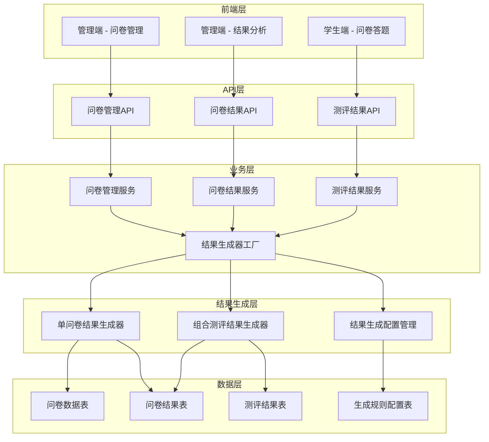
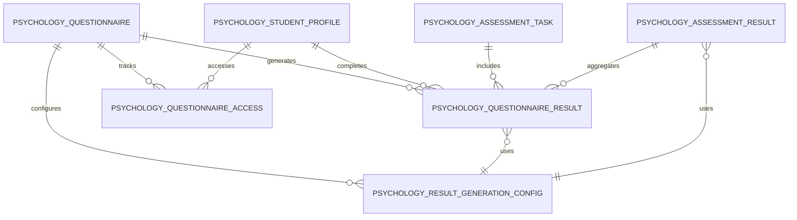

# 问卷管理迁移与结果生成优化设计文档

## 概述

本设计文档详细描述了将emojump-evaluation项目中的问卷管理、问卷结果和测评结果功能迁移到lvye-project心理模块的技术方案，并重新设计结果生成系统以支持多种问卷组合场景。系统采用模块化架构，将结果生成器分离为独立的问卷结果生成器和组合测评结果生成器，为未来的扩展提供灵活的基础架构。

## 架构设计

### 整体架构



### 模块架构重构

基于现有心理模块，新增问卷管理相关组件：

```
yudao-module-psychology/
├── src/main/java/cn/iocoder/yudao/module/psychology/
│   ├── controller/
│   │   ├── admin/
│   │   │   ├── questionnaire/           # 问卷管理控制器
│   │   │   ├── questionnaireresult/     # 问卷结果控制器
│   │   │   └── assessmentresult/        # 测评结果控制器
│   │   └── app/
│   │       ├── questionnaire/           # 学生端问卷控制器
│   │       └── questionnaireresult/     # 学生端结果控制器
│   ├── service/
│   │   ├── questionnaire/               # 问卷管理服务
│   │   ├── questionnaireresult/         # 问卷结果服务
│   │   ├── assessmentresult/            # 测评结果服务
│   │   └── resultgenerator/             # 结果生成器服务
│   │       ├── QuestionnaireResultGeneratorService.java
│   │       ├── AssessmentResultGeneratorService.java
│   │       ├── ResultGeneratorFactory.java
│   │       └── impl/
│   │           ├── SingleQuestionnaireResultGenerator.java
│   │           ├── CombinedAssessmentResultGenerator.java
│   │           └── ResultGeneratorConfigService.java
│   ├── dal/
│   │   ├── dataobject/
│   │   │   ├── questionnaire/           # 问卷相关DO
│   │   │   ├── questionnaireresult/     # 问卷结果DO
│   │   │   └── resultconfig/            # 结果配置DO
│   │   └── mysql/
│   │       ├── questionnaire/           # 问卷Mapper
│   │       ├── questionnaireresult/     # 问卷结果Mapper
│   │       └── resultconfig/            # 结果配置Mapper
│   ├── convert/
│   │   ├── questionnaire/               # 问卷转换器
│   │   ├── questionnaireresult/         # 问卷结果转换器
│   │   └── assessmentresult/            # 测评结果转换器
│   ├── enums/
│   │   ├── QuestionnaireStatusEnum.java
│   │   ├── ResultGeneratorTypeEnum.java
│   │   └── RiskLevelEnum.java
│   └── framework/
│       ├── resultgenerator/             # 结果生成器框架
│       │   ├── ResultGeneratorStrategy.java
│       │   ├── ResultGeneratorContext.java
│       │   └── ResultGeneratorRegistry.java
│       └── migration/                   # 数据迁移工具
│           ├── DataMigrationService.java
│           └── DataValidationService.java
```

## 数据模型设计

### 迁移后的数据表结构

#### 1. 问卷管理表 (psychology_questionnaire)

```sql
CREATE TABLE psychology_questionnaire (
    id BIGINT PRIMARY KEY AUTO_INCREMENT COMMENT '问卷ID',
    title VARCHAR(200) NOT NULL COMMENT '问卷标题',
    description TEXT COMMENT '问卷描述',
    questionnaire_type TINYINT NOT NULL COMMENT '问卷类型：1-心理健康，2-学习适应，3-人际关系，4-情绪管理',
    target_audience TINYINT NOT NULL COMMENT '目标对象：1-学生，2-家长',
    external_id VARCHAR(100) COMMENT '外部系统问卷ID',
    external_link VARCHAR(500) COMMENT '外部问卷链接',
    question_count INT NOT NULL COMMENT '题目数量',
    estimated_duration INT NOT NULL COMMENT '预计用时（分钟）',
    content JSON COMMENT '问卷内容（题目、选项等）',
    scoring_rules JSON COMMENT '评分规则配置',
    result_template JSON COMMENT '结果报告模板',
    status TINYINT DEFAULT 0 COMMENT '状态：0-草稿，1-已发布，2-已暂停，3-已关闭',
    is_open TINYINT DEFAULT 0 COMMENT '是否开放：0-否，1-是',
    access_count INT DEFAULT 0 COMMENT '访问次数',
    completion_count INT DEFAULT 0 COMMENT '完成次数',
    sync_status TINYINT DEFAULT 0 COMMENT '同步状态：0-未同步，1-已同步，2-同步失败',
    last_sync_time DATETIME COMMENT '最后同步时间',
    creator VARCHAR(64) DEFAULT '' COMMENT '创建者',
    create_time DATETIME DEFAULT CURRENT_TIMESTAMP COMMENT '创建时间',
    updater VARCHAR(64) DEFAULT '' COMMENT '更新者',
    update_time DATETIME DEFAULT CURRENT_TIMESTAMP ON UPDATE CURRENT_TIMESTAMP COMMENT '更新时间',
    deleted BIT(1) DEFAULT b'0' COMMENT '是否删除',
    tenant_id BIGINT DEFAULT 0 COMMENT '租户编号',
    
    KEY idx_questionnaire_type (questionnaire_type),
    KEY idx_target_audience (target_audience),
    KEY idx_status (status),
    KEY idx_external_id (external_id),
    KEY idx_create_time (create_time)
) COMMENT='心理问卷表';
```

#### 2. 问卷结果表 (psychology_questionnaire_result)

```sql
CREATE TABLE psychology_questionnaire_result (
    id BIGINT PRIMARY KEY AUTO_INCREMENT COMMENT '结果ID',
    questionnaire_id BIGINT NOT NULL COMMENT '问卷ID',
    student_profile_id BIGINT NOT NULL COMMENT '学生档案ID',
    assessment_task_id BIGINT COMMENT '关联的测评任务ID（如果是测评任务的一部分）',
    assessment_result_id BIGINT COMMENT '关联的测评结果ID',
    participant_type TINYINT NOT NULL COMMENT '参与者类型：1-学生本人，2-家长代答',
    answers JSON NOT NULL COMMENT '答题详情',
    raw_score DECIMAL(10,2) COMMENT '原始得分',
    standard_score DECIMAL(10,2) COMMENT '标准分',
    percentile_rank DECIMAL(5,2) COMMENT '百分位排名',
    risk_level TINYINT COMMENT '风险等级：1-正常，2-关注，3-预警，4-高危',
    level_description VARCHAR(100) COMMENT '等级描述',
    dimension_scores JSON COMMENT '各维度得分',
    result_data JSON COMMENT '详细结果数据',
    report_content TEXT COMMENT '结果报告内容',
    suggestions TEXT COMMENT '建议内容',
    completed_time DATETIME NOT NULL COMMENT '完成时间',
    generation_status TINYINT DEFAULT 0 COMMENT '生成状态：0-待生成，1-生成中，2-已生成，3-生成失败',
    generation_time DATETIME COMMENT '结果生成时间',
    generation_error TEXT COMMENT '生成错误信息',
    creator VARCHAR(64) DEFAULT '' COMMENT '创建者',
    create_time DATETIME DEFAULT CURRENT_TIMESTAMP COMMENT '创建时间',
    updater VARCHAR(64) DEFAULT '' COMMENT '更新者',
    update_time DATETIME DEFAULT CURRENT_TIMESTAMP ON UPDATE CURRENT_TIMESTAMP COMMENT '更新时间',
    deleted BIT(1) DEFAULT b'0' COMMENT '是否删除',
    tenant_id BIGINT DEFAULT 0 COMMENT '租户编号',
    
    UNIQUE KEY uk_questionnaire_student (questionnaire_id, student_profile_id, assessment_task_id),
    KEY idx_student_profile_id (student_profile_id),
    KEY idx_assessment_task_id (assessment_task_id),
    KEY idx_assessment_result_id (assessment_result_id),
    KEY idx_risk_level (risk_level),
    KEY idx_completed_time (completed_time),
    KEY idx_generation_status (generation_status)
) COMMENT='问卷结果表';
```

#### 3. 测评结果表 (psychology_assessment_result) - 扩展

```sql
-- 基于现有表结构扩展
ALTER TABLE psychology_assessment_result ADD COLUMN questionnaire_results JSON COMMENT '关联的问卷结果汇总';
ALTER TABLE psychology_assessment_result ADD COLUMN combined_risk_level TINYINT COMMENT '综合风险等级';
ALTER TABLE psychology_assessment_result ADD COLUMN risk_factors JSON COMMENT '风险因素分析';
ALTER TABLE psychology_assessment_result ADD COLUMN intervention_suggestions TEXT COMMENT '干预建议';
ALTER TABLE psychology_assessment_result ADD COLUMN generation_config_version VARCHAR(50) COMMENT '生成规则版本';
```

#### 4. 结果生成配置表 (psychology_result_generation_config)

```sql
CREATE TABLE psychology_result_generation_config (
    id BIGINT PRIMARY KEY AUTO_INCREMENT COMMENT '配置ID',
    config_name VARCHAR(100) NOT NULL COMMENT '配置名称',
    config_type TINYINT NOT NULL COMMENT '配置类型：1-单问卷结果，2-组合测评结果',
    questionnaire_id BIGINT COMMENT '问卷ID（单问卷配置）',
    assessment_template_id BIGINT COMMENT '测评模板ID（组合配置）',
    version VARCHAR(50) NOT NULL COMMENT '配置版本',
    scoring_algorithm JSON NOT NULL COMMENT '评分算法配置',
    risk_level_rules JSON NOT NULL COMMENT '风险等级判定规则',
    weight_config JSON COMMENT '权重配置（组合测评用）',
    report_template JSON NOT NULL COMMENT '报告模板配置',
    is_active TINYINT DEFAULT 1 COMMENT '是否激活：1-激活，0-停用',
    effective_time DATETIME NOT NULL COMMENT '生效时间',
    expire_time DATETIME COMMENT '过期时间',
    creator VARCHAR(64) DEFAULT '' COMMENT '创建者',
    create_time DATETIME DEFAULT CURRENT_TIMESTAMP COMMENT '创建时间',
    updater VARCHAR(64) DEFAULT '' COMMENT '更新者',
    update_time DATETIME DEFAULT CURRENT_TIMESTAMP ON UPDATE CURRENT_TIMESTAMP COMMENT '更新时间',
    deleted BIT(1) DEFAULT b'0' COMMENT '是否删除',
    tenant_id BIGINT DEFAULT 0 COMMENT '租户编号',
    
    UNIQUE KEY uk_config_version (config_name, version),
    KEY idx_config_type (config_type),
    KEY idx_questionnaire_id (questionnaire_id),
    KEY idx_assessment_template_id (assessment_template_id),
    KEY idx_is_active (is_active),
    KEY idx_effective_time (effective_time)
) COMMENT='结果生成配置表';
```

#### 5. 问卷访问记录表 (psychology_questionnaire_access)

```sql
CREATE TABLE psychology_questionnaire_access (
    id BIGINT PRIMARY KEY AUTO_INCREMENT COMMENT '访问记录ID',
    questionnaire_id BIGINT NOT NULL COMMENT '问卷ID',
    student_profile_id BIGINT NOT NULL COMMENT '学生档案ID',
    access_time DATETIME NOT NULL COMMENT '访问时间',
    access_ip VARCHAR(50) COMMENT '访问IP',
    user_agent TEXT COMMENT '用户代理',
    access_source TINYINT COMMENT '访问来源：1-直接访问，2-测评任务，3-推荐链接',
    session_duration INT COMMENT '会话时长（秒）',
    creator VARCHAR(64) DEFAULT '' COMMENT '创建者',
    create_time DATETIME DEFAULT CURRENT_TIMESTAMP COMMENT '创建时间',
    tenant_id BIGINT DEFAULT 0 COMMENT '租户编号',
    
    KEY idx_questionnaire_id (questionnaire_id),
    KEY idx_student_profile_id (student_profile_id),
    KEY idx_access_time (access_time)
) COMMENT='问卷访问记录表';
```

### 数据关系图



## 组件和接口设计

### 核心服务组件

#### 1. 问卷管理服务 (QuestionnaireService)

```java
@Service
public interface QuestionnaireService {
    
    /**
     * 创建问卷
     */
    Long createQuestionnaire(QuestionnaireCreateReqVO createReqVO);
    
    /**
     * 更新问卷
     */
    void updateQuestionnaire(QuestionnaireUpdateReqVO updateReqVO);
    
    /**
     * 删除问卷
     */
    void deleteQuestionnaire(Long id);
    
    /**
     * 获取问卷详情
     */
    QuestionnaireRespVO getQuestionnaire(Long id);
    
    /**
     * 获取问卷分页列表
     */
    PageResult<QuestionnaireRespVO> getQuestionnairePage(QuestionnairePageReqVO pageReqVO);
    
    /**
     * 发布问卷到外部系统
     */
    void publishQuestionnaireToExternal(Long id);
    
    /**
     * 暂停外部问卷
     */
    void pauseQuestionnaireInExternal(Long id);
    
    /**
     * 同步外部问卷状态
     */
    void syncQuestionnaireStatus();
    
    /**
     * 测试问卷链接
     */
    boolean testQuestionnaireLink(Long id);
    
    /**
     * 获取可用问卷列表（用于测评任务选择）
     */
    List<QuestionnaireSimpleRespVO> getAvailableQuestionnaires(Integer targetAudience);
}
```

#### 2. 问卷结果服务 (QuestionnaireResultService)

```java
@Service
public interface QuestionnaireResultService {
    
    /**
     * 创建问卷结果
     */
    Long createQuestionnaireResult(QuestionnaireResultCreateReqVO createReqVO);
    
    /**
     * 提交问卷答案
     */
    Long submitQuestionnaireAnswer(QuestionnaireAnswerSubmitReqVO submitReqVO);
    
    /**
     * 生成问卷结果
     */
    GenerateResultRespVO generateQuestionnaireResult(GenerateResultReqVO generateReqVO);
    
    /**
     * 获取问卷结果详情
     */
    QuestionnaireResultRespVO getQuestionnaireResult(Long id);
    
    /**
     * 获取问卷结果分页列表
     */
    PageResult<QuestionnaireResultRespVO> getQuestionnaireResultPage(QuestionnaireResultPageReqVO pageReqVO);
    
    /**
     * 根据学生ID获取问卷结果列表
     */
    List<QuestionnaireResultRespVO> getQuestionnaireResultsByStudentId(Long studentId);
    
    /**
     * 根据测评结果ID获取关联的问卷结果
     */
    List<QuestionnaireResultRespVO> getQuestionnaireResultsByAssessmentResultId(Long assessmentResultId);
    
    /**
     * 批量删除问卷结果
     */
    void deleteQuestionnaireResultBatch(Collection<Long> ids);
    
    /**
     * 导出问卷结果
     */
    void exportQuestionnaireResultExcel(QuestionnaireResultPageReqVO exportReqVO, HttpServletResponse response);
    
    /**
     * 检查问卷是否支持结果生成
     */
    boolean checkQuestionnaireSupport(Long questionnaireId);
    
    /**
     * 获取支持的问卷列表
     */
    List<Long> getSupportedQuestionnaires();
}
```

#### 3. 测评结果服务 (AssessmentResultService) - 扩展

```java
@Service
public interface AssessmentResultService {
    
    /**
     * 生成测评结果（基于多个问卷结果）
     */
    GenerateAssessmentResultRespVO generateAssessmentResult(GenerateAssessmentResultReqVO generateReqVO);
    
    /**
     * 获取测评结果详情
     */
    AssessmentResultRespVO getAssessmentResult(Long id);
    
    /**
     * 获取测评结果分页列表
     */
    PageResult<AssessmentResultRespVO> getAssessmentResultPage(AssessmentResultPageReqVO pageReqVO);
    
    /**
     * 获取学生的最新测评结果
     */
    AssessmentResultRespVO getLatestAssessmentResult(Long assessmentId, Long studentId);
    
    /**
     * 获取学生的历史测评结果
     */
    List<AssessmentResultRespVO> getHistoryAssessmentResults(Long assessmentId, Long studentId);
    
    /**
     * 检查所有问卷结果是否完成
     */
    CheckCompletedRespVO checkAllAssessmentResultsCompleted(CheckCompletedReqVO reqVO);
    
    /**
     * 获取用户测评记录
     */
    UserAssessmentRecordsRespVO getUserAssessmentRecords(UserAssessmentRecordsReqVO reqVO);
}
```

### 结果生成器框架设计

#### 1. 结果生成器策略接口

```java
public interface ResultGeneratorStrategy {
    
    /**
     * 获取生成器类型
     */
    ResultGeneratorTypeEnum getGeneratorType();
    
    /**
     * 检查是否支持该问卷/测评
     */
    boolean supports(Long targetId, ResultGeneratorTypeEnum type);
    
    /**
     * 生成结果
     */
    <T> T generateResult(ResultGenerationContext context);
    
    /**
     * 验证生成参数
     */
    void validateGenerationParams(ResultGenerationContext context);
}
```

#### 2. 单问卷结果生成器

```java
@Component
public class SingleQuestionnaireResultGenerator implements ResultGeneratorStrategy {
    
    @Override
    public ResultGeneratorTypeEnum getGeneratorType() {
        return ResultGeneratorTypeEnum.SINGLE_QUESTIONNAIRE;
    }
    
    @Override
    public boolean supports(Long questionnaireId, ResultGeneratorTypeEnum type) {
        return ResultGeneratorTypeEnum.SINGLE_QUESTIONNAIRE.equals(type) 
               && isQuestionnaireSupported(questionnaireId);
    }
    
    @Override
    public QuestionnaireResultVO generateResult(ResultGenerationContext context) {
        // 1. 获取问卷配置和答题数据
        QuestionnaireConfigVO config = getQuestionnaireConfig(context.getQuestionnaireId());
        List<AnswerVO> answers = context.getAnswers();
        
        // 2. 计算原始得分
        BigDecimal rawScore = calculateRawScore(answers, config.getScoringRules());
        
        // 3. 计算标准分和百分位
        BigDecimal standardScore = calculateStandardScore(rawScore, config);
        BigDecimal percentileRank = calculatePercentileRank(standardScore, config);
        
        // 4. 确定风险等级
        RiskLevelEnum riskLevel = determineRiskLevel(standardScore, config.getRiskLevelRules());
        
        // 5. 计算各维度得分
        Map<String, BigDecimal> dimensionScores = calculateDimensionScores(answers, config);
        
        // 6. 生成结果报告
        String reportContent = generateReportContent(config.getReportTemplate(), 
                                                   rawScore, standardScore, riskLevel, dimensionScores);
        
        // 7. 生成建议内容
        String suggestions = generateSuggestions(riskLevel, dimensionScores, config);
        
        return QuestionnaireResultVO.builder()
                .rawScore(rawScore)
                .standardScore(standardScore)
                .percentileRank(percentileRank)
                .riskLevel(riskLevel.getCode())
                .levelDescription(riskLevel.getDescription())
                .dimensionScores(dimensionScores)
                .reportContent(reportContent)
                .suggestions(suggestions)
                .build();
    }
    
    private BigDecimal calculateRawScore(List<AnswerVO> answers, ScoringRulesVO scoringRules) {
        // 实现评分算法
        return BigDecimal.ZERO;
    }
    
    private RiskLevelEnum determineRiskLevel(BigDecimal score, RiskLevelRulesVO rules) {
        // 实现风险等级判定逻辑
        return RiskLevelEnum.NORMAL;
    }
    
    // 其他辅助方法...
}
```

#### 3. 组合测评结果生成器

```java
@Component
public class CombinedAssessmentResultGenerator implements ResultGeneratorStrategy {
    
    @Override
    public ResultGeneratorTypeEnum getGeneratorType() {
        return ResultGeneratorTypeEnum.COMBINED_ASSESSMENT;
    }
    
    @Override
    public boolean supports(Long assessmentId, ResultGeneratorTypeEnum type) {
        return ResultGeneratorTypeEnum.COMBINED_ASSESSMENT.equals(type) 
               && isAssessmentSupported(assessmentId);
    }
    
    @Override
    public AssessmentResultVO generateResult(ResultGenerationContext context) {
        // 1. 获取所有关联的问卷结果
        List<QuestionnaireResultVO> questionnaireResults = context.getQuestionnaireResults();
        
        // 2. 获取组合测评配置
        AssessmentConfigVO config = getAssessmentConfig(context.getAssessmentId());
        
        // 3. 计算加权综合得分
        BigDecimal combinedScore = calculateCombinedScore(questionnaireResults, config.getWeightConfig());
        
        // 4. 确定综合风险等级
        RiskLevelEnum combinedRiskLevel = determineCombinedRiskLevel(questionnaireResults, config);
        
        // 5. 分析风险因素
        List<RiskFactorVO> riskFactors = analyzeRiskFactors(questionnaireResults, config);
        
        // 6. 生成干预建议
        List<InterventionSuggestionVO> interventionSuggestions = 
                generateInterventionSuggestions(combinedRiskLevel, riskFactors, config);
        
        // 7. 生成综合报告
        String comprehensiveReport = generateComprehensiveReport(
                questionnaireResults, combinedScore, combinedRiskLevel, riskFactors, config);
        
        return AssessmentResultVO.builder()
                .combinedScore(combinedScore)
                .combinedRiskLevel(combinedRiskLevel.getCode())
                .riskFactors(riskFactors)
                .interventionSuggestions(interventionSuggestions)
                .comprehensiveReport(comprehensiveReport)
                .questionnaireResults(questionnaireResults)
                .build();
    }
    
    private BigDecimal calculateCombinedScore(List<QuestionnaireResultVO> results, 
                                            WeightConfigVO weightConfig) {
        // 实现加权综合评分算法
        BigDecimal totalScore = BigDecimal.ZERO;
        BigDecimal totalWeight = BigDecimal.ZERO;
        
        for (QuestionnaireResultVO result : results) {
            BigDecimal weight = weightConfig.getWeight(result.getQuestionnaireId());
            totalScore = totalScore.add(result.getStandardScore().multiply(weight));
            totalWeight = totalWeight.add(weight);
        }
        
        return totalWeight.compareTo(BigDecimal.ZERO) > 0 ? 
               totalScore.divide(totalWeight, 2, RoundingMode.HALF_UP) : BigDecimal.ZERO;
    }
    
    private RiskLevelEnum determineCombinedRiskLevel(List<QuestionnaireResultVO> results, 
                                                   AssessmentConfigVO config) {
        // 实现综合风险等级判定逻辑
        // 可以采用最高风险等级、加权平均、或自定义算法
        return results.stream()
                .map(r -> RiskLevelEnum.fromCode(r.getRiskLevel()))
                .max(Comparator.comparing(RiskLevelEnum::getLevel))
                .orElse(RiskLevelEnum.NORMAL);
    }
    
    // 其他辅助方法...
}
```

#### 4. 结果生成器工厂

```java
@Component
public class ResultGeneratorFactory {
    
    private final Map<ResultGeneratorTypeEnum, ResultGeneratorStrategy> generators;
    
    public ResultGeneratorFactory(List<ResultGeneratorStrategy> generatorList) {
        this.generators = generatorList.stream()
                .collect(Collectors.toMap(
                    ResultGeneratorStrategy::getGeneratorType,
                    Function.identity()
                ));
    }
    
    public ResultGeneratorStrategy getGenerator(ResultGeneratorTypeEnum type) {
        ResultGeneratorStrategy generator = generators.get(type);
        if (generator == null) {
            throw new IllegalArgumentException("Unsupported generator type: " + type);
        }
        return generator;
    }
    
    public <T> T generateResult(ResultGeneratorTypeEnum type, ResultGenerationContext context) {
        ResultGeneratorStrategy generator = getGenerator(type);
        generator.validateGenerationParams(context);
        return generator.generateResult(context);
    }
}
```

#### 5. 结果生成上下文

```java
@Data
@Builder
public class ResultGenerationContext {
    
    /**
     * 生成类型
     */
    private ResultGeneratorTypeEnum generationType;
    
    /**
     * 问卷ID（单问卷结果生成）
     */
    private Long questionnaireId;
    
    /**
     * 测评ID（组合测评结果生成）
     */
    private Long assessmentId;
    
    /**
     * 学生档案ID
     */
    private Long studentProfileId;
    
    /**
     * 答题数据（单问卷）
     */
    private List<AnswerVO> answers;
    
    /**
     * 问卷结果列表（组合测评）
     */
    private List<QuestionnaireResultVO> questionnaireResults;
    
    /**
     * 参与者类型
     */
    private Integer participantType;
    
    /**
     * 生成配置版本
     */
    private String configVersion;
    
    /**
     * 扩展参数
     */
    private Map<String, Object> extraParams;
}
```

### API接口设计

#### 1. 问卷管理API

```java
@RestController
@RequestMapping("/admin-api/psychology/questionnaire")
@Tag(name = "管理后台 - 问卷管理")
public class QuestionnaireController {
    
    @PostMapping("/create")
    @Operation(summary = "创建问卷")
    public CommonResult<Long> createQuestionnaire(@Valid @RequestBody QuestionnaireCreateReqVO createReqVO) {
        return success(questionnaireService.createQuestionnaire(createReqVO));
    }
    
    @PutMapping("/update")
    @Operation(summary = "更新问卷")
    public CommonResult<Boolean> updateQuestionnaire(@Valid @RequestBody QuestionnaireUpdateReqVO updateReqVO) {
        questionnaireService.updateQuestionnaire(updateReqVO);
        return success(true);
    }
    
    @DeleteMapping("/delete")
    @Operation(summary = "删除问卷")
    public CommonResult<Boolean> deleteQuestionnaire(@RequestParam("id") Long id) {
        questionnaireService.deleteQuestionnaire(id);
        return success(true);
    }
    
    @GetMapping("/get")
    @Operation(summary = "获取问卷详情")
    public CommonResult<QuestionnaireRespVO> getQuestionnaire(@RequestParam("id") Long id) {
        return success(questionnaireService.getQuestionnaire(id));
    }
    
    @GetMapping("/page")
    @Operation(summary = "获取问卷分页")
    public CommonResult<PageResult<QuestionnaireRespVO>> getQuestionnairePage(@Valid QuestionnairePageReqVO pageVO) {
        return success(questionnaireService.getQuestionnairePage(pageVO));
    }
    
    @PostMapping("/publish-external/{id}")
    @Operation(summary = "发布问卷到外部系统")
    public CommonResult<Boolean> publishQuestionnaireToExternal(@PathVariable("id") Long id) {
        questionnaireService.publishQuestionnaireToExternal(id);
        return success(true);
    }
    
    @PostMapping("/pause-external/{id}")
    @Operation(summary = "暂停外部问卷")
    public CommonResult<Boolean> pauseQuestionnaireInExternal(@PathVariable("id") Long id) {
        questionnaireService.pauseQuestionnaireInExternal(id);
        return success(true);
    }
    
    @PostMapping("/test-link/{id}")
    @Operation(summary = "测试问卷链接")
    public CommonResult<Boolean> testQuestionnaireLink(@PathVariable("id") Long id) {
        return success(questionnaireService.testQuestionnaireLink(id));
    }
    
    @GetMapping("/available-list")
    @Operation(summary = "获取可用问卷列表")
    public CommonResult<List<QuestionnaireSimpleRespVO>> getAvailableQuestionnaires(
            @RequestParam(value = "targetAudience", required = false) Integer targetAudience) {
        return success(questionnaireService.getAvailableQuestionnaires(targetAudience));
    }
}
```

#### 2. 问卷结果API

```java
@RestController
@RequestMapping("/admin-api/psychology/questionnaire-result")
@Tag(name = "管理后台 - 问卷结果管理")
public class QuestionnaireResultController {
    
    @PostMapping("/create")
    @Operation(summary = "创建问卷结果")
    public CommonResult<Long> createQuestionnaireResult(@Valid @RequestBody QuestionnaireResultCreateReqVO createReqVO) {
        return success(questionnaireResultService.createQuestionnaireResult(createReqVO));
    }
    
    @PostMapping("/submit-answer")
    @Operation(summary = "提交问卷答案")
    public CommonResult<Long> submitQuestionnaireAnswer(@Valid @RequestBody QuestionnaireAnswerSubmitReqVO submitReqVO) {
        return success(questionnaireResultService.submitQuestionnaireAnswer(submitReqVO));
    }
    
    @PostMapping("/generate-result")
    @Operation(summary = "生成问卷结果")
    public CommonResult<GenerateResultRespVO> generateQuestionnaireResult(@Valid @RequestBody GenerateResultReqVO generateReqVO) {
        return success(questionnaireResultService.generateQuestionnaireResult(generateReqVO));
    }
    
    @GetMapping("/get")
    @Operation(summary = "获取问卷结果详情")
    public CommonResult<QuestionnaireResultRespVO> getQuestionnaireResult(@RequestParam("id") Long id) {
        return success(questionnaireResultService.getQuestionnaireResult(id));
    }
    
    @GetMapping("/page")
    @Operation(summary = "获取问卷结果分页")
    public CommonResult<PageResult<QuestionnaireResultRespVO>> getQuestionnaireResultPage(@Valid QuestionnaireResultPageReqVO pageVO) {
        return success(questionnaireResultService.getQuestionnaireResultPage(pageVO));
    }
    
    @GetMapping("/list-by-student")
    @Operation(summary = "根据学生ID获取问卷结果列表")
    public CommonResult<List<QuestionnaireResultRespVO>> getQuestionnaireResultsByStudentId(@RequestParam("studentId") Long studentId) {
        return success(questionnaireResultService.getQuestionnaireResultsByStudentId(studentId));
    }
    
    @GetMapping("/list-by-assessment-result")
    @Operation(summary = "根据测评结果ID获取关联的问卷结果")
    public CommonResult<List<QuestionnaireResultRespVO>> getQuestionnaireResultsByAssessmentResultId(@RequestParam("assessmentResultId") Long assessmentResultId) {
        return success(questionnaireResultService.getQuestionnaireResultsByAssessmentResultId(assessmentResultId));
    }
    
    @DeleteMapping("/delete-batch")
    @Operation(summary = "批量删除问卷结果")
    public CommonResult<Boolean> deleteQuestionnaireResultBatch(@RequestBody Collection<Long> ids) {
        questionnaireResultService.deleteQuestionnaireResultBatch(ids);
        return success(true);
    }
    
    @GetMapping("/export-excel")
    @Operation(summary = "导出问卷结果Excel")
    public void exportQuestionnaireResultExcel(@Valid QuestionnaireResultPageReqVO exportReqVO, HttpServletResponse response) {
        questionnaireResultService.exportQuestionnaireResultExcel(exportReqVO, response);
    }
    
    @GetMapping("/check-support")
    @Operation(summary = "检查问卷是否支持结果生成")
    public CommonResult<Boolean> checkQuestionnaireSupport(@RequestParam("questionnaireId") Long questionnaireId) {
        return success(questionnaireResultService.checkQuestionnaireSupport(questionnaireId));
    }
    
    @GetMapping("/supported-questionnaires")
    @Operation(summary = "获取支持的问卷列表")
    public CommonResult<List<Long>> getSupportedQuestionnaires() {
        return success(questionnaireResultService.getSupportedQuestionnaires());
    }
}
```

## 错误处理

### 错误码定义

```java
public interface ErrorCodeConstants {
    
    // ========== 问卷管理相关 1-003-010-000 ==========
    ErrorCode QUESTIONNAIRE_NOT_EXISTS = new ErrorCode(1_003_010_000, "问卷不存在");
    ErrorCode QUESTIONNAIRE_NOT_PUBLISHED = new ErrorCode(1_003_010_001, "问卷未发布");
    ErrorCode QUESTIONNAIRE_ALREADY_PUBLISHED = new ErrorCode(1_003_010_002, "问卷已发布");
    ErrorCode QUESTIONNAIRE_SYNC_FAILED = new ErrorCode(1_003_010_003, "问卷同步失败");
    ErrorCode QUESTIONNAIRE_LINK_INVALID = new ErrorCode(1_003_010_004, "问卷链接无效");
    
    // ========== 问卷结果相关 1-003-011-000 ==========
    ErrorCode QUESTIONNAIRE_RESULT_NOT_EXISTS = new ErrorCode(1_003_011_000, "问卷结果不存在");
    ErrorCode QUESTIONNAIRE_RESULT_ALREADY_EXISTS = new ErrorCode(1_003_011_001, "问卷结果已存在");
    ErrorCode QUESTIONNAIRE_RESULT_GENERATION_FAILED = new ErrorCode(1_003_011_002, "问卷结果生成失败");
    ErrorCode QUESTIONNAIRE_NOT_SUPPORTED = new ErrorCode(1_003_011_003, "问卷不支持结果生成");
    ErrorCode QUESTIONNAIRE_ANSWERS_INCOMPLETE = new ErrorCode(1_003_011_004, "问卷答案不完整");
    
    // ========== 测评结果相关 1-003-012-000 ==========
    ErrorCode ASSESSMENT_RESULT_GENERATION_FAILED = new ErrorCode(1_003_012_000, "测评结果生成失败");
    ErrorCode ASSESSMENT_QUESTIONNAIRE_RESULTS_INCOMPLETE = new ErrorCode(1_003_012_001, "测评关联的问卷结果不完整");
    ErrorCode ASSESSMENT_CONFIG_NOT_FOUND = new ErrorCode(1_003_012_002, "测评配置未找到");
    
    // ========== 结果生成器相关 1-003-013-000 ==========
    ErrorCode RESULT_GENERATOR_NOT_FOUND = new ErrorCode(1_003_013_000, "结果生成器未找到");
    ErrorCode RESULT_GENERATION_CONFIG_INVALID = new ErrorCode(1_003_013_001, "结果生成配置无效");
    ErrorCode RESULT_GENERATION_TIMEOUT = new ErrorCode(1_003_013_002, "结果生成超时");
    
    // ========== 数据迁移相关 1-003-014-000 ==========
    ErrorCode DATA_MIGRATION_FAILED = new ErrorCode(1_003_014_000, "数据迁移失败");
    ErrorCode DATA_VALIDATION_FAILED = new ErrorCode(1_003_014_001, "数据验证失败");
    ErrorCode DATA_INCONSISTENCY_DETECTED = new ErrorCode(1_003_014_002, "检测到数据不一致");
}
```

## 测试策略

### 单元测试

1. **结果生成器测试**
   - 单问卷结果生成器功能测试
   - 组合测评结果生成器功能测试
   - 边界条件和异常情况测试

2. **服务层测试**
   - 问卷管理服务测试
   - 问卷结果服务测试
   - 测评结果服务测试

3. **数据访问层测试**
   - Mapper接口功能测试
   - 复杂查询逻辑测试
   - 数据一致性测试

### 集成测试

1. **API接口测试**
   - 问卷管理API完整流程测试
   - 问卷结果生成API测试
   - 测评结果生成API测试

2. **数据迁移测试**
   - 迁移脚本功能测试
   - 数据完整性验证测试
   - 性能压力测试

3. **外部系统集成测试**
   - 问卷同步功能测试
   - 外部API调用测试
   - 错误处理和重试机制测试

### 性能测试

1. **结果生成性能测试**
   - 单问卷结果生成性能测试
   - 组合测评结果生成性能测试
   - 并发生成场景测试

2. **数据库性能测试**
   - 大数据量查询性能测试
   - 复杂关联查询优化测试
   - 索引效果验证测试

## 部署策略

### 数据迁移计划

1. **迁移前准备**
   - 备份现有数据
   - 验证迁移脚本
   - 准备回滚方案

2. **分阶段迁移**
   - 第一阶段：迁移问卷管理数据
   - 第二阶段：迁移问卷结果数据
   - 第三阶段：迁移测评结果数据

3. **迁移后验证**
   - 数据完整性检查
   - 功能验证测试
   - 性能基准测试

### 灰度发布

1. **功能开关控制**
   - 新旧系统并行运行
   - 逐步切换用户流量
   - 监控系统稳定性

2. **回滚机制**
   - 快速回滚到旧系统
   - 数据同步和一致性保证
   - 用户体验无缝切换

这个设计文档提供了完整的技术方案，包括数据模型重构、结果生成器架构优化、API接口设计等关键组件。通过策略模式实现了灵活的结果生成系统，能够很好地支持单问卷结果和组合测评结果的不同场景需求。