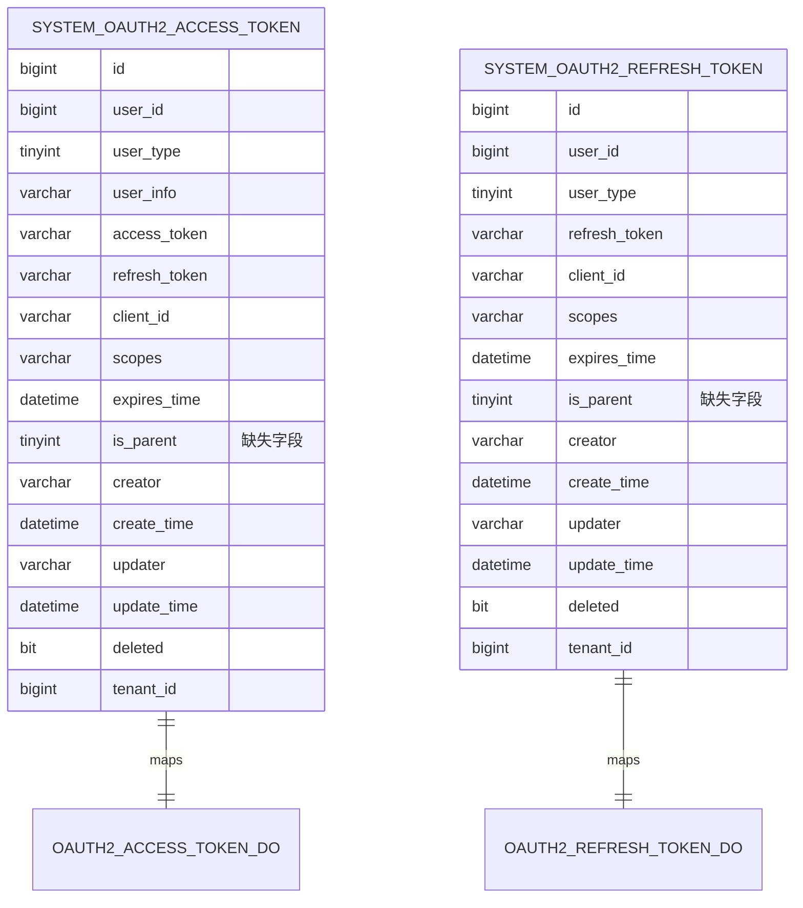

# OAuth2数据库字段缺失错误修复设计

## 概述

本文档设计修复 OAuth2 访问令牌和刷新令牌表中缺失 `is_parent` 字段导致的 SQL 语法错误问题。

### 问题描述

项目运行时出现以下错误：
```
org.springframework.jdbc.BadSqlGrammarException: 
### Error querying database. Cause: java.sql.SQLSyntaxErrorException: Unknown column 'is_parent' in 'field list'
### SQL: SELECT id, access_token, refresh_token, user_id, user_type, user_info, client_id, scopes, expires_time, is_parent, tenant_id, create_time, update_time, creator, updater, deleted FROM system_oauth2_access_token WHERE deleted = 0 AND (access_token = ?)
```

### 根本原因

通过代码分析发现：
1. **OAuth2AccessTokenDO** 和 **OAuth2RefreshTokenDO** 实体类中都定义了 `isParent` 字段
2. MySQL 数据库的表结构中缺失 `is_parent` 字段
3. 其他数据库（DM、PostgreSQL、Kingbase、OpenGauss）的表结构都包含此字段
4. 测试环境的 H2 数据库表结构也包含此字段

## 架构设计

### 影响范围

#### 数据库层
- `system_oauth2_access_token` 表缺少 `is_parent` 字段
- `system_oauth2_refresh_token` 表缺少 `is_parent` 字段

#### 应用层
- OAuth2AccessTokenDO 实体类已包含 `isParent` 字段
- OAuth2RefreshTokenDO 实体类已包含 `isParent` 字段
- OAuth2TokenService 业务逻辑中使用了 `isParent` 字段
- 相关的 Mapper 查询会涉及此字段

### 数据库字段规范

#### is_parent 字段定义
```sql
`is_parent` tinyint DEFAULT NULL COMMENT '是否家长登录'
```

**字段属性说明：**
- 类型：`tinyint`
- 默认值：`NULL`
- 注释：是否家长登录
- 用途：标识用户登录类型，用于教育场景下区分学生和家长账号

### 表结构对比分析

#### 现有其他数据库表结构


## 修复方案设计

### 1. 数据库架构修复

#### MySQL表结构修复方案
通过 ALTER TABLE 语句为两个表添加缺失的 `is_parent` 字段：

**system_oauth2_access_token 表修复：**
```sql
ALTER TABLE `system_oauth2_access_token` 
ADD COLUMN `is_parent` tinyint DEFAULT NULL COMMENT '是否家长登录' 
AFTER `expires_time`;
```

**system_oauth2_refresh_token 表修复：**
```sql
ALTER TABLE `system_oauth2_refresh_token` 
ADD COLUMN `is_parent` tinyint DEFAULT NULL COMMENT '是否家长登录' 
AFTER `expires_time`;
```

#### 字段位置说明
- 将 `is_parent` 字段放置在 `expires_time` 字段之后
- 与其他数据库的表结构保持一致
- 符合字段逻辑分组原则

### 2. SQL脚本创建

#### 创建数据库修复脚本
创建独立的SQL修复脚本文件：`sql/mysql/fix_oauth2_is_parent_column.sql`

```sql
-- 修复 system_oauth2_access_token 表缺失 is_parent 字段
-- 检查字段是否存在，避免重复添加
SET @count = (
    SELECT COUNT(*) 
    FROM information_schema.COLUMNS 
    WHERE TABLE_SCHEMA = DATABASE() 
    AND TABLE_NAME = 'system_oauth2_access_token' 
    AND COLUMN_NAME = 'is_parent'
);

SET @sql = IF(@count = 0, 
    'ALTER TABLE `system_oauth2_access_token` ADD COLUMN `is_parent` tinyint DEFAULT NULL COMMENT ''是否家长登录'' AFTER `expires_time`;', 
    'SELECT ''字段 is_parent 已存在于 system_oauth2_access_token 表中'' AS message;'
);

PREPARE stmt1 FROM @sql;
EXECUTE stmt1;
DEALLOCATE PREPARE stmt1;

-- 修复 system_oauth2_refresh_token 表缺失 is_parent 字段
SET @count = (
    SELECT COUNT(*) 
    FROM information_schema.COLUMNS 
    WHERE TABLE_SCHEMA = DATABASE() 
    AND TABLE_NAME = 'system_oauth2_refresh_token' 
    AND COLUMN_NAME = 'is_parent'
);

SET @sql = IF(@count = 0, 
    'ALTER TABLE `system_oauth2_refresh_token` ADD COLUMN `is_parent` tinyint DEFAULT NULL COMMENT ''是否家长登录'' AFTER `expires_time`;', 
    'SELECT ''字段 is_parent 已存在于 system_oauth2_refresh_token 表中'' AS message;'
);

PREPARE stmt2 FROM @sql;
EXECUTE stmt2;
DEALLOCATE PREPARE stmt2;
```

### 3. 主SQL文件更新

#### 更新 ruoyi-vue-pro.sql 文件
修改 `sql/mysql/ruoyi-vue-pro.sql` 文件中的表结构定义：

**system_oauth2_access_token 表更新：**
```sql
CREATE TABLE `system_oauth2_access_token`  (
  `id` bigint NOT NULL AUTO_INCREMENT COMMENT '编号',
  `user_id` bigint NOT NULL COMMENT '用户编号',
  `user_type` tinyint NOT NULL COMMENT '用户类型',
  `user_info` varchar(512) CHARACTER SET utf8mb4 COLLATE utf8mb4_unicode_ci NOT NULL COMMENT '用户信息',
  `access_token` varchar(255) CHARACTER SET utf8mb4 COLLATE utf8mb4_unicode_ci NOT NULL COMMENT '访问令牌',
  `refresh_token` varchar(32) CHARACTER SET utf8mb4 COLLATE utf8mb4_unicode_ci NOT NULL COMMENT '刷新令牌',
  `client_id` varchar(255) CHARACTER SET utf8mb4 COLLATE utf8mb4_unicode_ci NOT NULL COMMENT '客户端编号',
  `scopes` varchar(255) CHARACTER SET utf8mb4 COLLATE utf8mb4_unicode_ci NULL DEFAULT NULL COMMENT '授权范围',
  `expires_time` datetime NOT NULL COMMENT '过期时间',
  `is_parent` tinyint DEFAULT NULL COMMENT '是否家长登录',
  `creator` varchar(64) CHARACTER SET utf8mb4 COLLATE utf8mb4_unicode_ci NULL DEFAULT '' COMMENT '创建者',
  `create_time` datetime NOT NULL DEFAULT CURRENT_TIMESTAMP COMMENT '创建时间',
  `updater` varchar(64) CHARACTER SET utf8mb4 COLLATE utf8mb4_unicode_ci NULL DEFAULT '' COMMENT '更新者',
  `update_time` datetime NOT NULL DEFAULT CURRENT_TIMESTAMP ON UPDATE CURRENT_TIMESTAMP COMMENT '更新时间',
  `deleted` bit(1) NOT NULL DEFAULT b'0' COMMENT '是否删除',
  `tenant_id` bigint NOT NULL DEFAULT 0 COMMENT '租户编号',
  PRIMARY KEY (`id`) USING BTREE,
  INDEX `idx_access_token`(`access_token` ASC) USING BTREE,
  INDEX `idx_refresh_token`(`refresh_token` ASC) USING BTREE
) ENGINE = InnoDB AUTO_INCREMENT = 16697 CHARACTER SET = utf8mb4 COLLATE = utf8mb4_unicode_ci COMMENT = 'OAuth2 访问令牌';
```

**system_oauth2_refresh_token 表更新：**
```sql
CREATE TABLE `system_oauth2_refresh_token`  (
  `id` bigint NOT NULL AUTO_INCREMENT COMMENT '编号',
  `user_id` bigint NOT NULL COMMENT '用户编号',
  `refresh_token` varchar(32) CHARACTER SET utf8mb4 COLLATE utf8mb4_unicode_ci NOT NULL COMMENT '刷新令牌',
  `user_type` tinyint NOT NULL COMMENT '用户类型',
  `client_id` varchar(255) CHARACTER SET utf8mb4 COLLATE utf8mb4_unicode_ci NOT NULL COMMENT '客户端编号',
  `scopes` varchar(255) CHARACTER SET utf8mb4 COLLATE utf8mb4_unicode_ci NULL DEFAULT NULL COMMENT '授权范围',
  `expires_time` datetime NOT NULL COMMENT '过期时间',
  `is_parent` tinyint DEFAULT NULL COMMENT '是否家长登录',
  `creator` varchar(64) CHARACTER SET utf8mb4 COLLATE utf8mb4_unicode_ci NULL DEFAULT '' COMMENT '创建者',
  `create_time` datetime NOT NULL DEFAULT CURRENT_TIMESTAMP COMMENT '创建时间',
  `updater` varchar(64) CHARACTER SET utf8mb4 COLLATE utf8mb4_unicode_ci NULL DEFAULT '' COMMENT '更新者',
  `update_time` datetime NOT NULL DEFAULT CURRENT_TIMESTAMP ON UPDATE CURRENT_TIMESTAMP COMMENT '更新时间',
  `deleted` bit(1) NOT NULL DEFAULT b'0' COMMENT '是否删除',
  `tenant_id` bigint NOT NULL DEFAULT 0 COMMENT '租户编号',
  PRIMARY KEY (`id`) USING BTREE
) ENGINE = InnoDB AUTO_INCREMENT = 2036 CHARACTER SET = utf8mb4 COLLATE = utf8mb4_unicode_ci COMMENT = 'OAuth2 刷新令牌';
```

## 实施流程

### 执行步骤

#### 1. 立即修复（生产环境）
```sql
-- 直接执行修复脚本
ALTER TABLE `system_oauth2_access_token` ADD COLUMN `is_parent` tinyint DEFAULT NULL COMMENT '是否家长登录' AFTER `expires_time`;
ALTER TABLE `system_oauth2_refresh_token` ADD COLUMN `is_parent` tinyint DEFAULT NULL COMMENT '是否家长登录' AFTER `expires_time`;
```

#### 2. 代码库更新
1. 更新 `sql/mysql/ruoyi-vue-pro.sql` 文件中的表结构
2. 创建 `sql/mysql/fix_oauth2_is_parent_column.sql` 修复脚本
3. 提交代码变更

#### 3. 验证测试
1. 重启应用服务
2. 测试 OAuth2 登录功能
3. 验证访问令牌查询正常
4. 检查刷新令牌功能

### 回滚方案

#### 紧急回滚
如果修复后出现问题，可以通过以下SQL回滚：
```sql
ALTER TABLE `system_oauth2_access_token` DROP COLUMN `is_parent`;
ALTER TABLE `system_oauth2_refresh_token` DROP COLUMN `is_parent`;
```

**注意：** 由于实体类中已存在该字段，不建议执行回滚操作，应优先解决应用层问题。

## 质量保证

### 数据完整性验证

#### 验证表结构一致性
```sql
-- 检查字段是否添加成功
SELECT COLUMN_NAME, DATA_TYPE, IS_NULLABLE, COLUMN_DEFAULT, COLUMN_COMMENT
FROM information_schema.COLUMNS 
WHERE TABLE_SCHEMA = DATABASE() 
AND TABLE_NAME IN ('system_oauth2_access_token', 'system_oauth2_refresh_token')
AND COLUMN_NAME = 'is_parent';
```

#### 验证应用功能
1. **登录功能测试**
   - 管理员用户登录
   - 普通用户登录
   - 家长用户登录（如果支持）

2. **令牌操作测试**
   - 访问令牌获取
   - 刷新令牌操作  
   - 令牌过期处理

### 兼容性检查

#### 跨数据库兼容性
- MySQL：添加 `is_parent` 字段
- PostgreSQL：已有 `is_parent` 字段 ✓
- Oracle：已有 `is_parent` 字段 ✓  
- DM：已有 `is_parent` 字段 ✓
- Kingbase：已有 `is_parent` 字段 ✓
- OpenGauss：已有 `is_parent` 字段 ✓

#### 应用版本兼容性
- 新版本：支持 `is_parent` 字段功能
- 历史版本：字段为 NULL，不影响基本功能

## 风险评估

### 低风险
- **数据库操作风险**：ADD COLUMN 操作对现有数据无影响
- **应用兼容性风险**：实体类已支持该字段，添加后完全兼容
- **性能影响**：添加 NULL 字段对查询性能无明显影响

### 预防措施
1. **备份数据库**：执行前完整备份相关表
2. **测试环境验证**：先在测试环境完整验证修复方案
3. **监控应用状态**：修复后密切监控应用运行状态
4. **准备回滚方案**：确保可以快速回滚（虽然不推荐）

## 监控指标

### 关键指标监控
- OAuth2 登录成功率
- 访问令牌查询响应时间  
- 刷新令牌操作成功率
- 数据库连接状态
- 应用错误日志

### 告警阈值
- OAuth2 登录失败率 > 5%
- 令牌查询响应时间 > 500ms
- 数据库连接错误 > 0

通过以上设计方案，可以完全修复 OAuth2 数据库字段缺失问题，确保系统稳定运行。