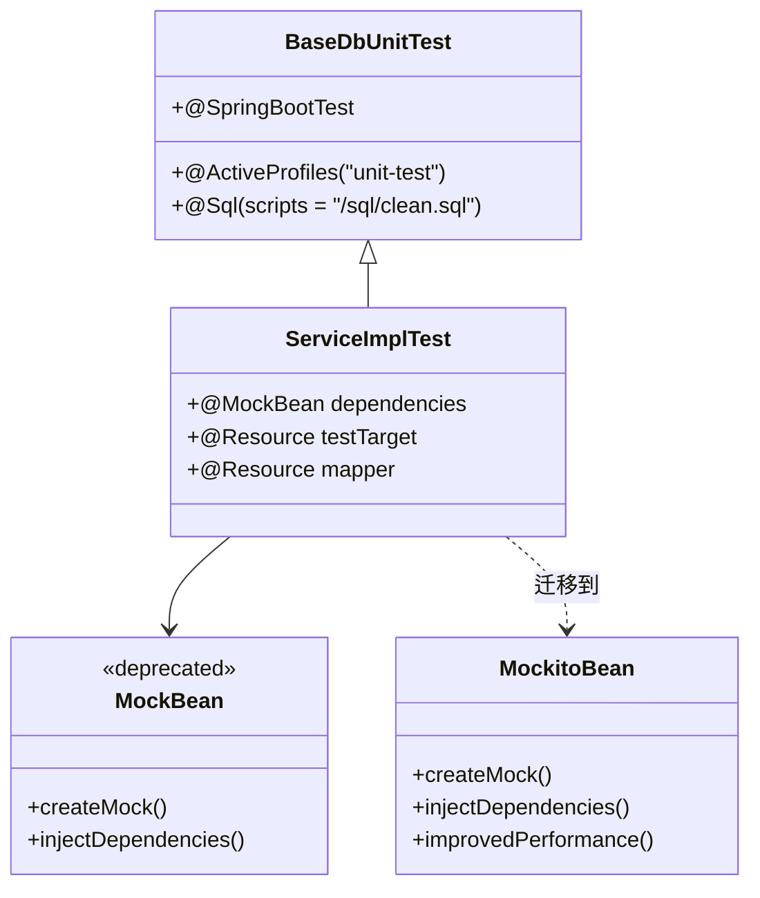

# 修复 MockBean 过时警告问题设计

## 1. 问题概述

### 1.1 问题描述
在项目编译过程中，系统模块（yudao-module-system）的单元测试出现大量关于 `@MockBean` 注解过时的编译警告：

```
[WARNING] org.springframework.boot.test.mock.mockito 中的 org.springframework.boot.test.mock.mockito.MockBean 已过时, 且被标记为删除
```

### 1.2 影响范围
受影响的测试文件包括：
- `DictDataServiceImplTest.java`
- `SmsTemplateServiceImplTest.java` 
- `SocialClientServiceImplTest.java`
- `SocialUserServiceImplTest.java`
- `TenantPackageServiceImplTest.java`

### 1.3 根本原因
从 Spring Boot 3.4.0 开始，`@MockBean` 和 `@SpyBean` 注解已被官方弃用，推荐使用 Spring Framework 提供的新注解：
- `@MockBean` → `@MockitoBean`
- `@SpyBean` → `@MockitoSpyBean`

## 2. 技术架构分析

### 2.1 当前测试架构


### 2.2 注解对比分析

| 特性 | @MockBean | @MockitoBean |
|------|-----------|--------------|
| 来源 | Spring Boot Test | Spring Framework |
| 状态 | 已弃用 (3.4.0+) | 推荐使用 |
| 性能 | 较慢的上下文重置 | 优化的上下文管理 |
| 功能 | 完整mock功能 | 完整mock功能 |
| 兼容性 | 向后兼容 | 新版本推荐 |

### 2.3 迁移影响评估
```mermaid
graph TD
    A[当前@MockBean] --> B[编译警告]
    A --> C[功能正常]
    A --> D[性能较慢]
    
    E[@MockitoBean迁移] --> F[消除警告]
    E --> G[功能保持]
    E --> H[性能提升]
    
    B --> I[影响开发体验]
    F --> J[清洁构建输出]
```

## 3. 修复方案设计

### 3.1 迁移策略
采用渐进式迁移策略，分批次替换过时注解：

1. **阶段1**: 系统模块测试文件迁移
2. **阶段2**: 其他模块测试文件检查和迁移  
3. **阶段3**: 验证和清理

### 3.2 代码修改模式

#### 3.2.1 导入语句更新
```java
// 旧的导入
import org.springframework.boot.test.mock.mockito.MockBean;

// 新的导入  
import org.springframework.test.context.bean.override.mockito.MockitoBean;
```

#### 3.2.2 注解替换
```java
// 修改前
@MockBean
private DictTypeService dictTypeService;

// 修改后
@MockitoBean
private DictTypeService dictTypeService;
```

### 3.3 修改清单

#### 3.3.1 DictDataServiceImplTest.java
- 位置：第38行
- 修改：`@MockBean` → `@MockitoBean`
- 对象：`DictTypeService dictTypeService`

#### 3.3.2 SmsTemplateServiceImplTest.java  
- 位置：第48行、第50行
- 修改：`@MockBean` → `@MockitoBean`
- 对象：
  - `SmsChannelService smsChannelService`
  - `SmsClient smsClient`

#### 3.3.3 SocialClientServiceImplTest.java
- 位置：第58行、第61行、第63行、第65行、第67行、第69行
- 修改：`@MockBean` → `@MockitoBean`
- 对象：多个社交客户端相关依赖

#### 3.3.4 SocialUserServiceImplTest.java
- 位置：第53行
- 修改：`@MockBean` → `@MockitoBean`
- 对象：社交用户相关依赖

#### 3.3.5 TenantPackageServiceImplTest.java
- 位置：第45行
- 修改：`@MockBean` → `@MockitoBean`  
- 对象：租户包相关依赖

## 4. 实施步骤

### 4.1 准备阶段
1. 确认项目Spring Boot版本 (当前: 3.4.5)
2. 验证`@MockitoBean`注解可用性
3. 备份相关测试文件

### 4.2 执行阶段
1. **批量替换导入语句**
   ```bash
   # 查找需要修改的文件
   find yudao-module-system/src/test -name "*.java" -exec grep -l "@MockBean" {} \;
   ```

2. **逐个文件修改注解**
   - 替换import语句
   - 替换注解声明
   - 保持其他代码不变

3. **编译验证**
   ```bash
   mvn clean compile test-compile -pl yudao-module-system
   ```

### 4.3 验证阶段
1. **运行单元测试**
   ```bash
   mvn test -pl yudao-module-system
   ```

2. **检查警告消除**
   - 确认编译输出无警告
   - 验证测试功能正常

3. **性能对比**
   - 测试执行时间对比
   - 内存使用情况检查

## 5. 风险评估与应对

### 5.1 潜在风险

| 风险类型 | 影响程度 | 概率 | 应对措施 |
|----------|----------|------|----------|
| 功能回归 | 中 | 低 | 完整测试验证 |
| 编译错误 | 低 | 低 | 语法检查工具 |
| 性能变化 | 低 | 低 | 性能基准测试 |

### 5.2 回滚方案
如果迁移出现问题，可以快速回滚：
```bash
# 恢复备份文件
git checkout HEAD~1 -- yudao-module-system/src/test/
```

## 6. 验证标准

### 6.1 成功标准
- ✅ 编译无警告输出
- ✅ 所有单元测试通过
- ✅ 测试覆盖率保持不变
- ✅ 测试执行时间无显著增长

### 6.2 验证命令
```bash
# 完整验证流程
mvn clean compile test-compile test -pl yudao-module-system
```

## 7. 后续优化建议

### 7.1 长期维护
1. **代码审查规范**：在代码审查中检查新的测试文件是否使用了正确的注解
2. **IDE配置**：配置IDE检查规则，自动提示使用新注解
3. **文档更新**：更新项目测试编写指南

### 7.2 全项目扫描
建议对整个项目进行全面扫描，检查其他模块是否存在类似问题：
```bash
# 全项目搜索@MockBean使用情况
find . -name "*.java" -exec grep -l "@MockBean" {} \;
```

### 7.3 CI/CD集成
在持续集成流程中添加警告检查，确保新代码不引入类似问题。