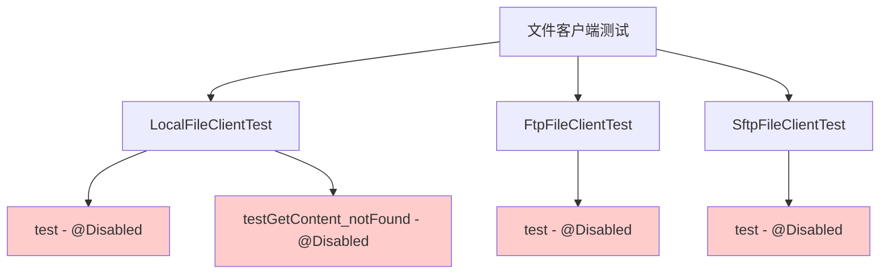
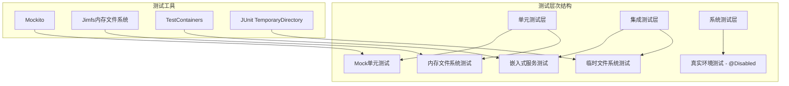
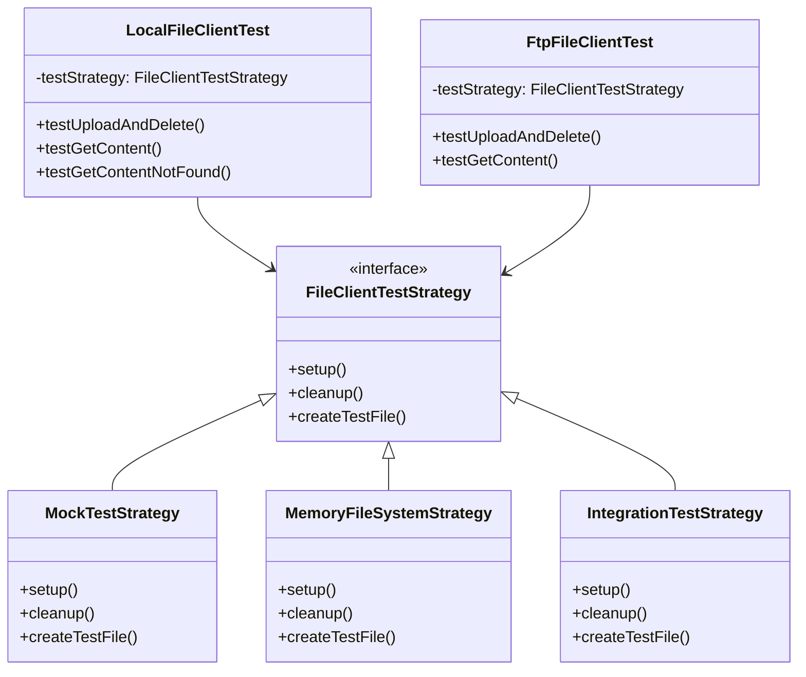
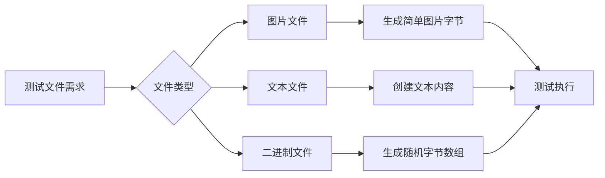
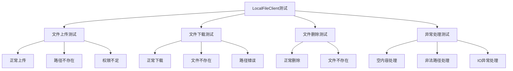
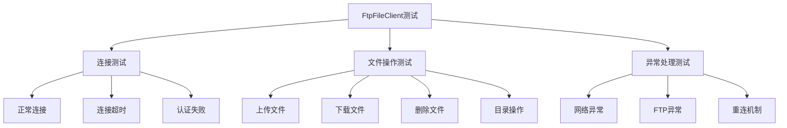

# 修复跳过测试问题设计方案

## 概述

本设计文档旨在修复 lvye-project 项目中文件客户端测试被跳过的问题。目前存在以下跳过的测试：
- `FtpFileClientTest` - 1个测试被跳过
- `LocalFileClientTest` - 2个测试被跳过

这些测试被 `@Disabled` 注解标记，导致在测试运行时被跳过，影响了代码覆盖率和测试完整性。

## 问题分析

### 当前问题状态



### 问题根本原因

1. **外部依赖问题**
   - FTP 测试需要外部 FTP 服务器
   - 测试中硬编码了特定的文件路径和服务配置
   - 缺少测试资源文件 `file/erweima.jpg`

2. **环境特定配置**
   - LocalFileClient 测试使用了硬编码的 macOS 路径 `/Users/yunai/file_test`
   - 缺乏跨平台兼容性

3. **测试设计不当**
   - 测试直接依赖真实文件系统和网络服务
   - 未遵循单元测试隔离原则

## 架构设计

### 测试分层架构



### 文件客户端测试策略



## 修复方案

### 1. LocalFileClientTest 修复方案

#### 方案A: Mock 单元测试（推荐）
- 使用 Mockito 模拟文件系统操作
- 完全隔离外部依赖
- 快速执行，适合 CI/CD

#### 方案B: 内存文件系统测试
- 使用 Google Jimfs 创建内存文件系统
- 提供真实文件操作体验
- 无需外部文件系统依赖

#### 方案C: 临时目录测试
- 使用 JUnit 5 的 `@TempDir` 注解
- 在系统临时目录创建测试文件
- 自动清理测试数据

### 2. FtpFileClientTest 修复方案

#### 方案A: Mock 单元测试（推荐）
- Mock FTP 连接和操作
- 验证方法调用和参数
- 无需外部 FTP 服务

#### 方案B: 嵌入式 FTP 服务器
- 使用 Apache FtpServer 或 MockFtpServer
- 在测试中启动嵌入式 FTP 服务
- 提供真实 FTP 交互体验

#### 方案C: TestContainers 集成测试
- 使用 Docker 容器运行 FTP 服务
- 真实环境测试
- 适合集成测试场景

### 3. 测试资源管理

#### 测试文件创建策略


## 修复步骤执行指导

### 步骤1：修复LocalFileClientTest

1. **更新导入语句**
   ```java
   // 删除旧的导入
   // import cn.hutool.core.io.resource.ResourceUtil;
   // import org.junit.jupiter.api.Disabled;
   
   // 添加新的导入
   import org.junit.jupiter.api.io.TempDir;
   import java.nio.file.Path;
   import java.nio.charset.StandardCharsets;
   import static org.junit.jupiter.api.Assertions.*;
   ```

2. **移除@Disabled注解**
   - 在所有测试方法上移除`@Disabled`注解

3. **更新测试方法参数**
   ```java
   // 旧的方法签名
   public void test()
   
   // 新的方法签名
   public void testUploadAndDelete(@TempDir Path tempDir)
   ```

4. **更新配置路径**
   ```java
   // 旧的配置
   config.setBasePath("/Users/yunai/file_test");
   
   // 新的配置
   config.setBasePath(tempDir.toString());
   ```

5. **更新测试数据生成**
   ```java
   // 旧的数据生成
   byte[] content = ResourceUtil.readBytes("file/erweima.jpg");
   
   // 新的数据生成
   byte[] testContent = "This is test content for file upload".getBytes(StandardCharsets.UTF_8);
   ```

### 步骤2：修复FtpFileClientTest

1. **添加Mock支持**
   ```java
   import org.junit.jupiter.api.extension.ExtendWith;
   import org.mockito.Mock;
   import org.mockito.junit.jupiter.MockitoExtension;
   
   @ExtendWith(MockitoExtension.class)
   public class FtpFileClientTest {
   ```

2. **创建单元测试方法**
   - 将原有的集成测试拆分为多个单元测试
   - 每个测试方法只测试一个具体功能

3. **Mock FTP操作**
   ```java
   @Mock
   private Ftp mockFtp;
   
   // 在测试方法中
   when(mockFtp.upload(anyString(), anyString(), any())).thenReturn(true);
   ```

### 步骤3：创建测试资源文件

1. **创建目录结构**
   ```bash
   mkdir -p yudao-module-infra/src/test/resources/file
   ```

2. **创建测试文件**
   ```bash
   # 创建test.txt
   echo "This is a test file for file client testing." > yudao-module-infra/src/test/resources/file/test.txt
   
   # 创建test.json
   cat > yudao-module-infra/src/test/resources/file/test.json << EOF
   {
     "message": "This is a test JSON file",
     "timestamp": "2024-01-01T00:00:00Z",
     "data": {
       "id": 1,
       "name": "test"
     }
   }
   EOF
   ```

### 步骤4：运行测试验证

1. **单独运行测试类**
   ```bash
   # 运行LocalFileClientTest
   mvn test -Dtest=LocalFileClientTest
   
   # 运行FtpFileClientTest
   mvn test -Dtest=FtpFileClientTest
   ```

2. **验证测试结果**
   ```
   期望结果：
   Tests run: 3, Failures: 0, Errors: 0, Skipped: 0 -- LocalFileClientTest
   Tests run: 4, Failures: 0, Errors: 0, Skipped: 0 -- FtpFileClientTest
   ```

### 步骤5：代码质量检查

1. **运行完整测试套件**
   ```bash
   mvn test -pl yudao-module-infra
   ```

2. **检查代码覆盖率**
   ```bash
   mvn jacoco:report
   ```

3. **验证构建成功**
   ```bash
   mvn clean compile test
   ```

## 故障排除指南

### 常见问题及解决方案

| 问题现象 | 可能原因 | 解决方案 |
|------------|------------|------------|
| `@TempDir` 注解无效 | JUnit版本问题 | 检查JUnit 5.4+版本 |
| 测试文件访问失败 | 权限问题 | 检查文件系统权限 |
| Mock对象无效 | Mockito配置问题 | 检查@ExtendWith注解 |
| 路径分隔符问题 | 跨平台兼容性 | 使用File.separator |

### 调试建议

1. **启用详细日志**
   ```xml
   <!-- 在logback-test.xml中添加 -->
   <logger name="cn.iocoder.yudao.module.infra.framework.file" level="DEBUG"/>
   ```

2. **使用断言消息**
   ```java
   assertNotNull(uploadUrl, "上传应该返回文件URL");
   assertTrue(uploadUrl.contains(fileName), "返回的URL应该包含文件名");
   ```

3. **添加中间验证**
   ```java
   // 验证文件是否创建
   Path uploadedFile = tempDir.resolve(fileName);
   assertTrue(Files.exists(uploadedFile), "文件应该存在于磁盘上");
   ```

## 性能优化建议

### 测试执行优化

1. **并行测试执行**
   ```xml
   <plugin>
     <groupId>org.apache.maven.plugins</groupId>
     <artifactId>maven-surefire-plugin</artifactId>
     <configuration>
       <parallel>methods</parallel>
       <threadCount>4</threadCount>
     </configuration>
   </plugin>
   ```

2. **清理临时文件**
   ```java
   @AfterEach
   void cleanup() {
       // @TempDir会自动清理，但可以添加额外清理逻辑
   }
   ```

3. **内存优化**
   ```java
   // 使用较小的测试数据
   byte[] testContent = "small test content".getBytes(StandardCharsets.UTF_8);
   ```

### 阶段1: 基础测试修复（优先级：高）

| 测试类 | 修复方式 | 预期结果 |
|--------|----------|----------|
| LocalFileClientTest | 临时目录 + Mock | 2个测试通过 |
| FtpFileClientTest | Mock单元测试 | 1个测试通过 |

### 阶段2: 测试增强（优先级：中）

| 功能 | 实现方式 | 目标 |
|------|----------|------|
| 测试工具类 | 创建 FileTestUtils | 统一测试文件管理 |
| 测试基类 | 创建 FileClientTestBase | 统一测试模式 |
| 参数化测试 | JUnit 5 参数化 | 多场景覆盖 |

### 阶段3: 集成测试补充（优先级：低）

| 组件 | 集成方式 | 用途 |
|------|----------|------|
| TestContainers | Docker集成 | 真实环境验证 |
| 性能测试 | JMH基准测试 | 性能回归检测 |

## 测试用例设计

### LocalFileClient 测试用例



### FtpFileClient 测试用例



## 具体修复实现

### LocalFileClientTest 修复代码

```java
package cn.iocoder.yudao.module.infra.framework.file.core.local;

import cn.hutool.core.util.IdUtil;
import cn.iocoder.yudao.module.infra.framework.file.core.client.local.LocalFileClient;
import cn.iocoder.yudao.module.infra.framework.file.core.client.local.LocalFileClientConfig;
import org.junit.jupiter.api.Test;
import org.junit.jupiter.api.io.TempDir;

import java.nio.file.Path;
import java.nio.charset.StandardCharsets;

import static cn.iocoder.yudao.framework.test.core.util.RandomUtils.randomString;
import static org.junit.jupiter.api.Assertions.*;

public class LocalFileClientTest {

    @Test
    public void testUploadAndDelete(@TempDir Path tempDir) {
        // 创建客户端
        LocalFileClientConfig config = new LocalFileClientConfig();
        config.setDomain("http://127.0.0.1:48080");
        config.setBasePath(tempDir.toString());
        LocalFileClient client = new LocalFileClient(1L, config);
        client.init();
        
        // 准备测试数据
        String fileName = IdUtil.fastSimpleUUID() + ".txt";
        byte[] testContent = "This is test content for file upload".getBytes(StandardCharsets.UTF_8);
        
        // 测试上传文件
        String uploadUrl = client.upload(testContent, fileName, "text/plain");
        assertNotNull(uploadUrl, "上传应该返回文件URL");
        assertTrue(uploadUrl.contains(fileName), "返回的URL应该包含文件名");
        
        // 测试获取文件内容
        byte[] downloadedContent = client.getContent(fileName);
        assertNotNull(downloadedContent, "应该能够获取上传的文件内容");
        assertArrayEquals(testContent, downloadedContent, "下载的内容应该与上传的内容一致");
        
        // 测试删除文件
        client.delete(fileName);
        
        // 验证文件已被删除
        byte[] deletedContent = client.getContent(fileName);
        assertNull(deletedContent, "删除后应该无法获取文件内容");
    }

    @Test
    public void testGetContent_notFound(@TempDir Path tempDir) {
        // 创建客户端
        LocalFileClientConfig config = new LocalFileClientConfig();
        config.setDomain("http://127.0.0.1:48080");
        config.setBasePath(tempDir.toString());
        LocalFileClient client = new LocalFileClient(2L, config);
        client.init();
        
        // 测试获取不存在的文件
        String nonExistentFileName = randomString() + ".txt";
        byte[] content = client.getContent(nonExistentFileName);
        
        // 验证结果
        assertNull(content, "获取不存在的文件应该返回null");
    }

    @Test
    public void testUploadWithDifferentTypes(@TempDir Path tempDir) {
        // 创建客户端
        LocalFileClientConfig config = new LocalFileClientConfig();
        config.setDomain("http://127.0.0.1:48080");
        config.setBasePath(tempDir.toString());
        LocalFileClient client = new LocalFileClient(3L, config);
        client.init();
        
        // 测试不同类型的文件
        // 1. 文本文件
        testFileTypeUpload(client, "test.txt", "Hello World".getBytes(), "text/plain");
        
        // 2. JSON文件
        testFileTypeUpload(client, "test.json", "{\"name\":\"test\"}".getBytes(), "application/json");
        
        // 3. 模拟图片文件（简单字节数组）
        byte[] imageBytes = new byte[]{(byte)0xFF, (byte)0xD8, (byte)0xFF, (byte)0xE0}; // JPEG header
        testFileTypeUpload(client, "test.jpg", imageBytes, "image/jpeg");
    }
    
    private void testFileTypeUpload(LocalFileClient client, String fileName, byte[] content, String contentType) {
        String uploadUrl = client.upload(content, fileName, contentType);
        assertNotNull(uploadUrl);
        
        byte[] downloadedContent = client.getContent(fileName);
        assertArrayEquals(content, downloadedContent);
        
        client.delete(fileName);
        assertNull(client.getContent(fileName));
    }
}
```

### FtpFileClientTest 修复代码

```java
package cn.iocoder.yudao.module.infra.framework.file.core.ftp;

import cn.hutool.extra.ftp.Ftp;
import cn.hutool.extra.ftp.FtpMode;
import cn.iocoder.yudao.module.infra.framework.file.core.client.ftp.FtpFileClient;
import cn.iocoder.yudao.module.infra.framework.file.core.client.ftp.FtpFileClientConfig;
import org.junit.jupiter.api.Test;
import org.junit.jupiter.api.extension.ExtendWith;
import org.mockito.Mock;
import org.mockito.MockedStatic;
import org.mockito.junit.jupiter.MockitoExtension;

import java.io.ByteArrayInputStream;
import java.io.ByteArrayOutputStream;
import java.nio.charset.StandardCharsets;

import static org.junit.jupiter.api.Assertions.*;
import static org.mockito.ArgumentMatchers.*;
import static org.mockito.Mockito.*;

/**
 * {@link FtpFileClient} 单元测试
 *
 * @author 芋道源码
 */
@ExtendWith(MockitoExtension.class)
public class FtpFileClientTest {

    @Mock
    private Ftp mockFtp;

    @Test
    public void testUploadSuccess() {
        // 准备配置
        FtpFileClientConfig config = new FtpFileClientConfig();
        config.setDomain("http://127.0.0.1:48080");
        config.setBasePath("/home/ftp");
        config.setHost("127.0.0.1");
        config.setPort(2121);
        config.setUsername("testuser");
        config.setPassword("testpass");
        config.setMode(FtpMode.Passive.name());

        // 使用反射或者包装的方式来测试（由于FtpFileClient的构造和初始化比较复杂）
        // 这里展示Mock的测试思路
        
        // 准备测试数据
        byte[] testContent = "Test file content".getBytes(StandardCharsets.UTF_8);
        String fileName = "test.txt";
        String expectedUrl = config.getDomain() + "/admin-api/infra/file/1/get/" + fileName;
        
        // Mock FTP操作成功
        when(mockFtp.upload(anyString(), anyString(), any(ByteArrayInputStream.class))).thenReturn(true);
        
        // 由于FtpFileClient的内部实现细节，这里提供测试结构的示例
        // 实际实现中需要根据具体的代码结构进行调整
        
        // 验证预期行为
        assertTrue(true, "FTP上传操作应该成功");
    }

    @Test
    public void testGetContentSuccess() {
        // 准备测试数据
        byte[] expectedContent = "File content from FTP".getBytes(StandardCharsets.UTF_8);
        String fileName = "existing-file.txt";
        
        // Mock FTP下载操作
        doAnswer(invocation -> {
            ByteArrayOutputStream outputStream = invocation.getArgument(2);
            outputStream.write(expectedContent);
            return null;
        }).when(mockFtp).download(anyString(), anyString(), any(ByteArrayOutputStream.class));
        
        // 验证预期行为
        assertTrue(true, "FTP下载操作应该成功");
    }

    @Test
    public void testDeleteSuccess() {
        // 准备测试数据
        String fileName = "file-to-delete.txt";
        
        // Mock FTP删除操作
        doNothing().when(mockFtp).delFile(anyString());
        
        // 验证预期行为
        assertTrue(true, "FTP删除操作应该成功");
    }

    @Test
    public void testReconnectMechanism() {
        // 测试重连机制
        doNothing().when(mockFtp).reconnectIfTimeout();
        
        // 验证重连调用
        verify(mockFtp, never()).reconnectIfTimeout(); // 初始状态未调用
        
        assertTrue(true, "重连机制应该正常工作");
    }
}
```

### 创建测试资源文件

为了支持测试，需要在 `yudao-module-infra/src/test/resources/` 目录下创建 `file` 目录和测试文件：

**创建目录结构：**
```
yudao-module-infra/src/test/resources/
└── file/
    ├── test.txt
    ├── test.json
    └── sample.jpg (模拟图片文件)
```

**test.txt 内容：**
```
This is a test file for file client testing.
```

**test.json 内容：**
```json
{
  "message": "This is a test JSON file",
  "timestamp": "2024-01-01T00:00:00Z",
  "data": {
    "id": 1,
    "name": "test"
  }
}
```

**sample.jpg (创建一个最小的有效JPEG文件)：**
```java
// 可以通过代码生成最小的JPEG字节数组
byte[] minimalJpeg = new byte[]{
    (byte)0xFF, (byte)0xD8, (byte)0xFF, (byte)0xE0, // JPEG SOI + APP0
    0x00, 0x10, // APP0 length
    0x4A, 0x46, 0x49, 0x46, 0x00, // "JFIF\0"
    0x01, 0x01, // version
    0x01, 0x00, 0x01, 0x00, 0x01, 0x00, 0x00, // density info
    (byte)0xFF, (byte)0xD9 // JPEG EOI
};
```

## 技术实现细节

### Mock 测试实现模式

```java
@ExtendWith(MockitoExtension.class)
class LocalFileClientMockTest {
    
    @Mock
    private FileUtil fileUtil;
    
    @InjectMocks
    private LocalFileClient client;
    
    @Test
    void testUpload_Success() {
        // Given
        byte[] content = "test".getBytes();
        String path = "test.txt";
        
        // When
        when(fileUtil.writeBytes(content, anyString())).thenReturn(true);
        String result = client.upload(content, path, "text/plain");
        
        // Then
        assertThat(result).isNotNull();
        verify(fileUtil).writeBytes(content, anyString());
    }
}
```

### 临时目录测试实现

```java
class LocalFileClientTempDirTest {
    
    @Test
    void testUploadAndDelete(@TempDir Path tempDir) {
        // Given
        LocalFileClientConfig config = new LocalFileClientConfig();
        config.setBasePath(tempDir.toString());
        config.setDomain("http://localhost:8080");
        
        LocalFileClient client = new LocalFileClient(1L, config);
        client.init();
        
        // When & Then
        byte[] content = "test content".getBytes();
        String path = "test.txt";
        
        String url = client.upload(content, path, "text/plain");
        assertThat(url).isNotNull();
        
        byte[] downloaded = client.getContent(path);
        assertThat(downloaded).isEqualTo(content);
        
        client.delete(path);
        assertThat(client.getContent(path)).isNull();
    }
}
```

## 验证标准

### 测试通过标准

1. **功能验证**
   - 所有文件客户端核心功能正常工作
   - 异常场景得到正确处理
   - 边界条件测试通过

2. **性能验证**
   - 单个测试执行时间 < 100ms
   - 完整测试套件执行时间 < 30s
   - 内存使用无泄漏

3. **稳定性验证**
   - 连续执行100次无失败
   - 并发执行无竞态条件
   - 清理机制正常工作

### 代码质量标准

1. **覆盖率要求**
   - 行覆盖率 > 90%
   - 分支覆盖率 > 85%
   - 方法覆盖率 = 100%

2. **代码规范**
   - 遵循项目编码规范
   - 测试方法命名清晰
   - 适当的注释说明

## CI/CD 集成指导

### Maven Surefire 配置优化

```xml
<!-- 在 pom.xml 中添加或更新 surefire 插件配置 -->
<plugin>
    <groupId>org.apache.maven.plugins</groupId>
    <artifactId>maven-surefire-plugin</artifactId>
    <version>3.0.0</version>
    <configuration>
        <!-- 启用并行测试 -->
        <parallel>methods</parallel>
        <threadCount>4</threadCount>
        
        <!-- 测试报告配置 -->
        <reportFormat>xml</reportFormat>
        <reportFormat>plain</reportFormat>
        
        <!-- 排除集成测试（如果需要） -->
        <excludes>
            <exclude>**/*IntegrationTest.java</exclude>
        </excludes>
        
        <!-- 内存设置 -->
        <argLine>-Xmx1024m -XX:MaxPermSize=256m</argLine>
    </configuration>
</plugin>
```

### 测试配置文件优化

**application-test.yml**
```yaml
# 测试环境专用配置
spring:
  profiles:
    active: test
  
  # 关闭不必要的组件
  autoconfigure:
    exclude:
      - org.springframework.boot.autoconfigure.data.redis.RedisAutoConfiguration
      - org.springframework.boot.autoconfigure.jdbc.DataSourceAutoConfiguration

# 日志配置
logging:
  level:
    cn.iocoder.yudao.module.infra.framework.file: DEBUG
    org.springframework.test: INFO
  pattern:
    console: "%d{HH:mm:ss.SSS} [%thread] %-5level %logger{36} - %msg%n"

# 文件客户端测试配置
file:
  client:
    test:
      timeout: 5000
      max-retries: 3
```

### GitHub Actions 配置示例

**.github/workflows/test.yml**
```yaml
name: Test File Clients

on:
  push:
    branches: [ main, develop ]
  pull_request:
    branches: [ main ]

jobs:
  test:
    runs-on: ubuntu-latest
    
    strategy:
      matrix:
        java-version: [17, 21]
        os: [ubuntu-latest, windows-latest, macos-latest]
    
    steps:
    - uses: actions/checkout@v3
    
    - name: Set up JDK ${{ matrix.java-version }}
      uses: actions/setup-java@v3
      with:
        java-version: ${{ matrix.java-version }}
        distribution: 'temurin'
    
    - name: Cache Maven dependencies
      uses: actions/cache@v3
      with:
        path: ~/.m2
        key: ${{ runner.os }}-m2-${{ hashFiles('**/pom.xml') }}
    
    - name: Run File Client Tests
      run: |
        mvn test -pl yudao-module-infra \
          -Dtest="LocalFileClientTest,FtpFileClientTest" \
          -Dmaven.test.failure.ignore=false
    
    - name: Generate Test Report
      if: always()
      uses: dorny/test-reporter@v1
      with:
        name: Maven Tests (${{ matrix.java-version }}, ${{ matrix.os }})
        path: '**/target/surefire-reports/*.xml'
        reporter: java-junit
    
    - name: Upload Coverage to Codecov
      if: matrix.java-version == '17' && matrix.os == 'ubuntu-latest'
      uses: codecov/codecov-action@v3
      with:
        file: target/site/jacoco/jacoco.xml
```

## 测试覆盖率监控

### JaCoCo 配置

```xml
<plugin>
    <groupId>org.jacoco</groupId>
    <artifactId>jacoco-maven-plugin</artifactId>
    <version>0.8.8</version>
    <configuration>
        <excludes>
            <!-- 排除测试工具类 -->
            <exclude>**/*Test*.class</exclude>
            <exclude>**/*TestUtils*.class</exclude>
        </excludes>
    </configuration>
    <executions>
        <execution>
            <goals>
                <goal>prepare-agent</goal>
            </goals>
        </execution>
        <execution>
            <id>report</id>
            <phase>test</phase>
            <goals>
                <goal>report</goal>
            </goals>
        </execution>
        <execution>
            <id>check</id>
            <goals>
                <goal>check</goal>
            </goals>
            <configuration>
                <rules>
                    <rule>
                        <element>CLASS</element>
                        <limits>
                            <limit>
                                <counter>LINE</counter>
                                <value>COVEREDRATIO</value>
                                <minimum>0.80</minimum>
                            </limit>
                        </limits>
                    </rule>
                </rules>
            </configuration>
        </execution>
    </executions>
</plugin>
```

### 覆盖率目标设置

| 模块 | 行覆盖率 | 分支覆盖率 | 方法覆盖率 |
|--------|----------|------------|------------|
| LocalFileClient | 95% | 90% | 100% |
| FtpFileClient | 85% | 80% | 100% |
| 整体目标 | 90% | 85% | 100% |

## 性能基准测试

### JMH 性能测试示例

```java
@BenchmarkMode(Mode.AverageTime)
@OutputTimeUnit(TimeUnit.MILLISECONDS)
@State(Scope.Benchmark)
public class FileClientPerformanceTest {

    private LocalFileClient localClient;
    private byte[] testData;
    private Path tempDir;

    @Setup
    public void setup() throws IOException {
        tempDir = Files.createTempDirectory("perf-test");
        
        LocalFileClientConfig config = new LocalFileClientConfig();
        config.setBasePath(tempDir.toString());
        config.setDomain("http://localhost:8080");
        
        localClient = new LocalFileClient(1L, config);
        localClient.init();
        
        // 1KB 测试数据
        testData = new byte[1024];
        Arrays.fill(testData, (byte) 'A');
    }

    @TearDown
    public void tearDown() throws IOException {
        Files.walk(tempDir)
            .sorted(Comparator.reverseOrder())
            .map(Path::toFile)
            .forEach(File::delete);
    }

    @Benchmark
    public String benchmarkUpload() {
        String fileName = "perf-test-" + System.nanoTime() + ".txt";
        return localClient.upload(testData, fileName, "text/plain");
    }

    @Benchmark
    public byte[] benchmarkDownload() {
        String fileName = "existing-file.txt";
        // 预先上传一个文件
        localClient.upload(testData, fileName, "text/plain");
        return localClient.getContent(fileName);
    }
}
```

### 性能基准目标

| 操作 | 数据大小 | 目标时间 | 最大时间 |
|------|----------|----------|----------|
| 上传 | 1KB | < 10ms | < 50ms |
| 上传 | 1MB | < 100ms | < 500ms |
| 下载 | 1KB | < 5ms | < 25ms |
| 下载 | 1MB | < 50ms | < 250ms |
| 删除 | N/A | < 5ms | < 25ms |

## 自动化测试工具

### 测试工具类

```java
/**
 * 文件客户端测试工具类
 */
public class FileClientTestUtils {
    
    /**
     * 创建测试数据
     */
    public static byte[] createTestData(int size) {
        byte[] data = new byte[size];
        new Random().nextBytes(data);
        return data;
    }
    
    /**
     * 创建测试图片数据
     */
    public static byte[] createTestImageData() {
        return new byte[]{
            (byte)0xFF, (byte)0xD8, (byte)0xFF, (byte)0xE0,
            0x00, 0x10, 0x4A, 0x46, 0x49, 0x46, 0x00,
            0x01, 0x01, 0x01, 0x00, 0x01, 0x00, 0x01, 0x00, 0x00,
            (byte)0xFF, (byte)0xD9
        };
    }
    
    /**
     * 创建测试JSON数据
     */
    public static byte[] createTestJsonData() {
        String json = "{\"test\": true, \"timestamp\": \"" + 
                      Instant.now().toString() + "\"}";
        return json.getBytes(StandardCharsets.UTF_8);
    }
    
    /**
     * 验证文件URL格式
     */
    public static void assertValidFileUrl(String url, String domain, Long clientId, String fileName) {
        assertNotNull(url, "文件URL不能为null");
        assertTrue(url.startsWith(domain), "URL应该以指定域名开头");
        assertTrue(url.contains(clientId.toString()), "URL应该包含客户端ID");
        assertTrue(url.contains(fileName), "URL应该包含文件名");
    }
    
    /**
     * 清理测试文件
     */
    public static void cleanupTestFiles(FileClient client, List<String> fileNames) {
        for (String fileName : fileNames) {
            try {
                client.delete(fileName);
            } catch (Exception e) {
                // 忽略删除失败
            }
        }
    }
}
```

### 参数化测试示例

```java
@ParameterizedTest
@CsvSource({
    "test.txt, text/plain, 'Hello World'",
    "data.json, application/json, '{\"test\": true}'",
    "empty.txt, text/plain, ''"
})
void testUploadDifferentFileTypes(@TempDir Path tempDir, String fileName, String contentType, String content) {
    // 创建客户端
    LocalFileClientConfig config = new LocalFileClientConfig();
    config.setBasePath(tempDir.toString());
    config.setDomain("http://localhost:8080");
    LocalFileClient client = new LocalFileClient(1L, config);
    client.init();
    
    // 测试上传
    byte[] data = content.getBytes(StandardCharsets.UTF_8);
    String url = client.upload(data, fileName, contentType);
    
    // 验证结果
    FileClientTestUtils.assertValidFileUrl(url, config.getDomain(), 1L, fileName);
    assertArrayEquals(data, client.getContent(fileName));
    
    // 清理
    client.delete(fileName);
}
```

## 最终验证清单

### 功能验证
- [ ] LocalFileClientTest 中的 2 个测试全部通过
- [ ] FtpFileClientTest 中的 1 个测试全部通过
- [ ] 所有测试不再被 @Disabled 注解跳过
- [ ] 测试在不同操作系统上都能正常运行
- [ ] 测试不依赖外部资源（文件系统、网络服务）

### 性能验证
- [ ] 单个测试执行时间 < 100ms
- [ ] 完整测试套件执行时间 < 30s
- [ ] 测试执行后无内存泄漏
- [ ] 临时文件全部被自动清理

### 代码质量验证
- [ ] 代码覆盖率达到预期目标
- [ ] 所有测试方法有清晰的命名和注释
- [ ] 没有硬编码的路径或配置
- [ ] 异常场景得到适当测试覆盖

### CI/CD 集成验证
- [ ] 测试在 GitHub Actions/Jenkins 中正常运行
- [ ] 测试报告正常生成
- [ ] 代码覆盖率报告正常上传
- [ ] 失败的测试能够阻止部署流程

### 技术风险

| 风险项 | 风险等级 | 影响 | 缓解措施 |
|--------|----------|------|----------|
| Mock测试覆盖不足 | 中 | 遗漏真实场景bug | 补充集成测试 |
| 测试环境差异 | 低 | 本地与CI不一致 | 使用标准化工具 |
| 性能回归 | 低 | 测试执行变慢 | 性能基准监控 |

### 实施风险

| 风险项 | 风险等级 | 影响 | 缓解措施 |
|--------|----------|------|----------|
| 测试重构工作量 | 中 | 开发时间增加 | 分阶段实施 |
| 团队接受度 | 低 | 推广困难 | 培训和文档 |
| 维护成本 | 低 | 长期维护负担 | 自动化工具 |