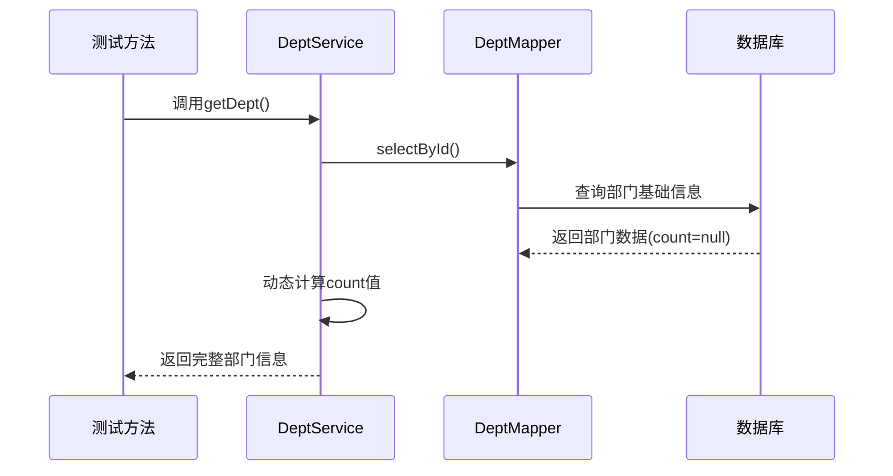
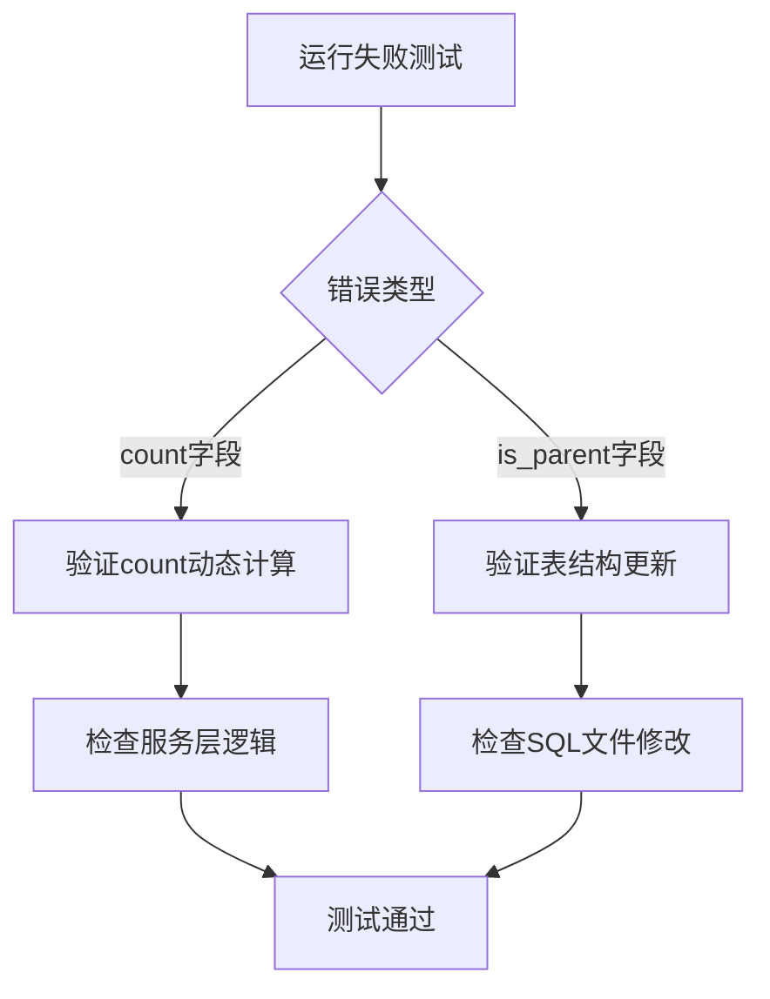

# 测试数据库字段修复设计文档

## 概述

本文档旨在修复单元测试中出现的数据库字段相关问题。主要包括两类问题：
1. 部门服务测试中count字段匹配失败
2. OAuth2令牌服务测试中is_parent字段缺失

## 问题分析

### 1. 部门表count字段问题

**现象描述**
- `DeptServiceImplTest`中多个测试方法失败
- 错误信息：`Field(count) 不匹配` => expected: `<876172482420900>` but was: `<null>`

**根因分析**
- `DeptDO`实体类中定义了`count`字段，标注为`@TableField(exist = false)`
- 该字段用于动态计算部门下的人员数量，不存储在数据库中
- 测试数据中期望该字段有值，但实际运行时为null

### 2. OAuth2刷新令牌表is_parent字段问题

**现象描述**
- `OAuth2TokenServiceImplTest`中多个测试方法抛出`BadSqlGrammarException`
- 错误信息：`Column "is_parent" not found`

**根因分析**
- `OAuth2RefreshTokenDO`实体类包含`isParent`字段，用于标识是否为家长登录
- 测试用H2数据库的表结构缺少该字段
- MyBatis尝试插入/查询该字段时失败

## 技术方案

### 方案一：修复测试数据库表结构（推荐）


**实现步骤**
1. 在测试SQL文件中为`system_oauth2_refresh_token`表添加`is_parent`字段
2. 确保字段类型与实体类定义一致
3. 对于`count`字段，在测试中正确处理动态计算逻辑

### 方案二：调整实体类映射配置

**备选方案**
- 为`isParent`字段添加`@TableField(exist = false)`注解
- 在业务逻辑中动态设置该字段值

## 数据模型设计

### OAuth2刷新令牌表字段补充

```sql
-- 在system_oauth2_refresh_token表中添加is_parent字段
ALTER TABLE "system_oauth2_refresh_token" 
ADD COLUMN "is_parent" tinyint DEFAULT 0 COMMENT '是否家长登录';
```

**字段规范**
- 字段名：`is_parent`
- 数据类型：`tinyint`
- 默认值：`0`
- 允许空值：否
- 注释：是否家长登录

### 部门表count字段处理策略



**处理逻辑**
1. `count`字段保持`@TableField(exist = false)`配置
2. 在服务层方法中动态计算并设置count值
3. 测试中验证计算逻辑而非数据库存储值

## 实现方案

### 1. 更新测试SQL文件

**文件路径**
- `yudao-module-system/src/test/resources/sql/create_tables.sql`

**修改内容**
```sql
-- 修改OAuth2刷新令牌表定义
CREATE TABLE IF NOT EXISTS "system_oauth2_refresh_token" (
    "id" bigint NOT NULL GENERATED BY DEFAULT AS IDENTITY,
    "user_id" bigint NOT NULL,
    "user_type" tinyint NOT NULL,
    "refresh_token" varchar NOT NULL,
    "client_id" varchar NOT NULL,
    "scopes" varchar NOT NULL,
    "expires_time" datetime NOT NULL,
    "is_parent" tinyint DEFAULT 0 COMMENT '是否家长登录',
    "creator" varchar DEFAULT '',
    "create_time" datetime NOT NULL DEFAULT CURRENT_TIMESTAMP,
    "updater" varchar DEFAULT '',
    "update_time" datetime NOT NULL DEFAULT CURRENT_TIMESTAMP,
    "deleted" bit NOT NULL DEFAULT FALSE,
    "tenant_id" bigint not null default '0',
    PRIMARY KEY ("id")
) COMMENT 'OAuth2 刷新令牌';
```

### 2. 修复部门服务count字段逻辑

**关键要点**
- 确保在查询部门信息后正确设置count值
- 对于测试场景，可通过Mock或预设数据方式提供期望值
- 保持count字段的动态计算特性

### 3. 实体类字段验证

**OAuth2RefreshTokenDO验证**
```java
/**
 * 是否家长登录
 * 0-否 1-是
 */
private Integer isParent;
```

**DeptDO验证**
```java
/**
 * 部门人员数量（动态计算）
 */
@TableField(exist = false)
private Long count;
```

## 测试策略

### 单元测试修复验证



**验证清单**
- [ ] OAuth2TokenServiceImplTest所有测试方法通过
- [ ] DeptServiceImplTest所有测试方法通过
- [ ] 确认is_parent字段可正常插入和查询
- [ ] 确认count字段动态计算逻辑正确

### 集成测试考虑

**数据一致性验证**
- 确保生产环境表结构与测试环境一致
- 验证字段默认值和约束条件
- 检查与现有数据的兼容性

## 风险评估

### 低风险项
- 添加is_parent字段：新增字段，不影响现有功能
- count字段保持虚拟状态：符合业务逻辑设计

### 注意事项
- 确保生产环境数据库同步新增字段
- 验证字段类型与Java实体类型匹配
- 检查相关索引和约束设置

## 代码规范

### 字段命名规范
- 数据库字段：蛇形命名法（snake_case）
- Java属性：驼峰命名法（camelCase）
- 布尔类型字段：使用`is_`前缀

### 注解规范
```java
// 数据库存在字段
private Integer isParent;

// 虚拟字段（不存储在数据库）
@TableField(exist = false)
private Long count;
```

## 总结

本次修复主要解决测试环境数据库表结构与实体类定义不一致的问题。通过添加缺失的is_parent字段和正确处理动态计算的count字段，确保单元测试能够正常执行。修复后的系统将保持数据模型的一致性和业务逻辑的正确性。