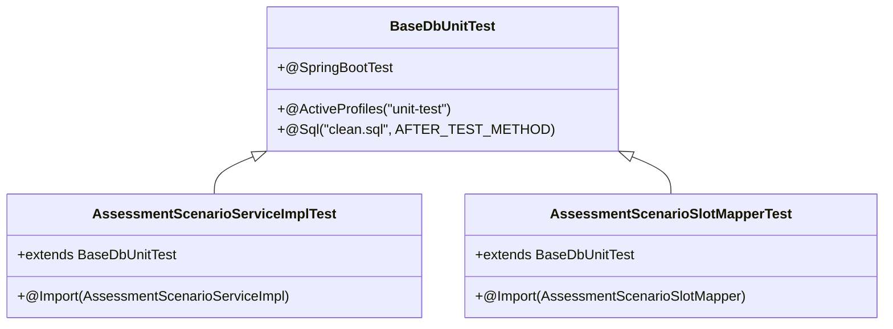
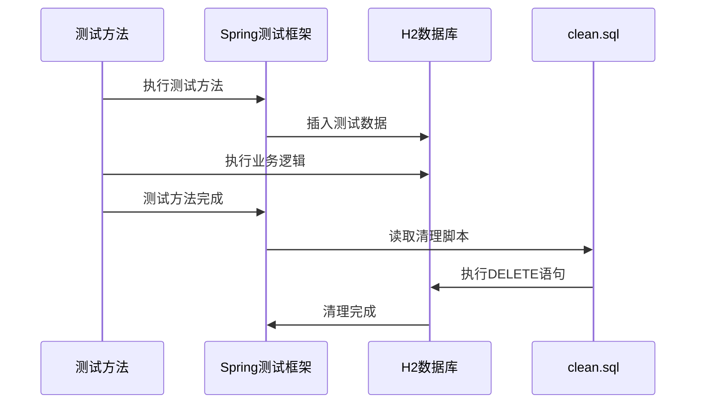

# 心理模块测试错误修复设计

## 概述

本设计文档旨在修复心理模块（yudao-module-psychology）中的单元测试错误，主要包括缺失的SQL清理脚本、@MockBean注解兼容性问题和测试断言错误。

## 问题分析

### 1. SQL清理脚本缺失问题

**错误现象：**
```
Cannot read SQL script from class path resource [sql/clean.sql]
```

**根本原因：**
- 心理模块缺少测试资源目录下的`clean.sql`文件
- `BaseDbUnitTest`基类通过`@Sql`注解在每个测试方法后执行清理脚本
- 清理脚本确保测试数据的独立性和可重复性

### 2. @MockBean注解兼容性问题

**错误现象：**
测试代码中使用了`@MockBean`注解，但在Spring Boot 3.4.5中应使用`@MockitoBean`

**根本原因：**
- Spring Boot 3.4.5版本中，测试框架的Mock注解发生了变更
- 需要将`@MockBean`替换为`@MockitoBean`以保持兼容性

### 3. 测试断言错误

**错误现象：**
```
AssessmentScenarioSlotMapperTest.testDeletePhysicallyByScenarioId:51 expected: <3> but was: <4>
```

**根本原因：**
- 测试预期删除2条记录后剩余1条，但实际剩余数量不匹配
- 可能存在数据初始化或清理逻辑问题

## 技术架构

### 测试框架结构



### 数据库清理机制



## 修复方案

### 1. 创建SQL清理脚本

**文件位置：** `yudao-module-psychology/src/test/resources/sql/clean.sql`

**清理内容：**
根据心理模块的表结构，清理以下表的数据：

```sql
-- 心理模块测试数据清理脚本
DELETE FROM "lvye_assessment_result";
DELETE FROM "lvye_assessment_task_questionnaire";
DELETE FROM "lvye_assessment_user_task";
DELETE FROM "lvye_assessment_dept_task";
DELETE FROM "lvye_assessment_task";
DELETE FROM "lvye_assessment_scenario_slot";
DELETE FROM "lvye_assessment_scenario";
DELETE FROM "lvye_questionnaire";
DELETE FROM "lvye_student_profile";
DELETE FROM "lvye_parent_contact";
```

**设计原则：**
- 按照外键依赖关系排序删除
- 先删除子表记录，再删除父表记录
- 使用双引号包围表名以兼容H2数据库
- 覆盖所有测试可能涉及的表

### 2. 修复Mock注解兼容性

**修改范围：**
- `AssessmentScenarioServiceImplTest.java`
- 其他包含`@MockBean`的测试类

**修改内容：**
```java
// 修改前
import org.springframework.boot.test.mock.mockito.MockBean;
@MockBean
private SomeService someService;

// 修改后  
import org.springframework.test.context.bean.override.mockito.MockitoBean;
@MockitoBean
private SomeService someService;
```

### 3. 修复测试断言逻辑

**问题分析：**
`testDeletePhysicallyByScenarioId`测试中期望删除后剩余1条记录，但实际剩余4条

**修复策略：**
1. 检查测试数据初始化逻辑
2. 验证删除方法的实现
3. 确保数据隔离性

**修复内容：**
```java
@Test
public void testDeletePhysicallyByScenarioId() {
    // 清理可能存在的数据
    assessmentScenarioSlotMapper.delete(null);
    
    // 准备测试数据 - 确保数据量可控
    // ... 插入已知数量的测试记录
    
    // 验证删除结果
    // ... 使用准确的期望值
}
```

## 实施步骤

### 第一阶段：创建SQL清理脚本

1. 在`yudao-module-psychology/src/test/resources/sql/`目录下创建`clean.sql`文件
2. 根据模块表结构编写完整的清理脚本
3. 确保脚本语法与H2数据库兼容

### 第二阶段：修复Mock注解

1. 检查所有测试类中的`@MockBean`使用
2. 替换为`@MockitoBean`注解
3. 更新相应的import语句

### 第三阶段：修复测试断言

1. 分析失败的测试用例
2. 修正测试数据准备逻辑
3. 调整断言期望值
4. 确保测试的独立性和可重复性

### 第四阶段：验证修复效果

1. 运行单个测试类验证修复
2. 运行完整测试套件
3. 确认所有测试通过

## 测试验证

### 验证清理脚本

```bash
# 运行单个测试类
mvn test -Dtest=AssessmentScenarioServiceImplTest

# 运行整个模块测试
mvn test -pl yudao-module-psychology
```

### 验证Mock注解修复

检查测试启动过程中是否有Mock相关的警告或错误信息。

### 验证断言修复

确保所有测试用例的断言都能正确通过，特别是涉及数据库操作的测试。

## 风险评估

### 低风险
- SQL清理脚本的创建和应用
- Mock注解的替换

### 中等风险  
- 测试断言逻辑的修改
- 可能影响其他依赖的测试

### 风险缓解措施
1. 逐步修复，分阶段验证
2. 保留原始测试代码备份
3. 运行完整测试套件确保无回归
4. 遵循项目既有的测试规范和模式

## 技术要求

### 开发环境
- JDK 17
- Maven 3.6+
- Spring Boot 3.4.5
- MyBatis Plus
- H2 数据库（测试）

### 测试规范
- 继承`BaseDbUnitTest`基类
- 使用H2内存数据库
- 每个测试方法后自动清理数据
- 使用`@MockitoBean`进行依赖模拟

### 代码质量
- 遵循项目现有的测试代码风格
- 确保测试的独立性和可重复性
- 添加必要的注释说明
- 保持测试用例的简洁性和可读性