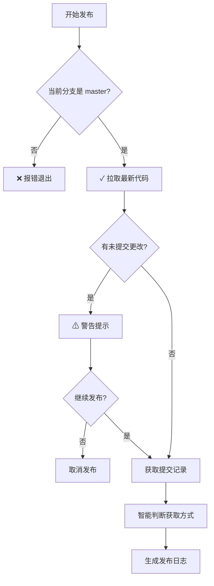

# 发布脚本安全性增强

## 🔒 新增的安全限制

### 1. Master 分支强制检查
- ✅ 发布操作**必须**在 `master` 分支执行
- ✅ 自动检测当前分支
- ✅ 非 master 分支会报错并提示切换

```bash
# 错误示例：在其他分支执行
$ git checkout develop
$ node script/release.mjs
❌ 错误：发布必须在 master 分支进行
   当前分支：develop
   请先切换到 master 分支：git checkout master
```

### 2. 自动同步最新代码
- ✅ 执行发布前自动 `git pull origin master`
- ✅ 确保基于最新代码发布
- ✅ 避免版本冲突

### 3. 智能 Git Commit 获取

#### 获取逻辑优先级：

| 场景 | 获取方式 | 示例 |
|------|---------|------|
| **新版本发布** | 最新 tag → HEAD | `v0.0.1..HEAD` |
| **已有多个版本** | 最近两个 tag 之间 | `v0.0.1..v0.0.2` |
| **首次发布** | 最近 15 条提交 | `git log -15` |
| **异常情况** | 最近 10 条提交 | 备用方案 |

#### 示例：

```bash
# 场景1：准备发布 v0.0.2，当前最新 tag 是 v0.0.1
获取 v0.0.1 到 HEAD 之间的提交

# 场景2：查看已发布的 v0.0.2 版本（v0.0.1 → v0.0.2）
获取 v0.0.1 到 v0.0.2 之间的提交

# 场景3：首次发布 v0.0.1
首次发布，获取最近 15 条提交
```

## 🛡️ 安全检查流程



## 📝 使用建议

### 正确的发布流程：

```bash
# 1. 切换到 master 分支
git checkout master

# 2. 确保代码最新
git pull origin master

# 3. 执行发布脚本
node script/release-v2.mjs  # 新版（独立版本）
# 或
node script/release.mjs     # 原版

# 脚本会自动：
# - 验证分支
# - 同步代码
# - 获取相关 commits
# - 生成发布说明
# - 创建版本 tag
```

### 版本 Tag 命名规范：

| 项目类型 | Tag 格式 | 示例 |
|----------|----------|------|
| 后端 | `mindtrip-backend-v{version}` | `mindtrip-backend-v0.0.1` |
| 前端 | `mindtrip-frontend-v{version}` | `mindtrip-frontend-v0.0.1` |
| 全栈 | `mindtrip-v{version}` | `mindtrip-v0.0.1` |
| 原版 | `v{version}` | `v2.7.0` |

## ⚠️ 注意事项

1. **分支限制**：只能在 master 分支发布，确保生产代码的一致性
2. **自动同步**：发布前会自动拉取最新代码，避免冲突
3. **提交获取**：智能判断获取方式，确保发布日志的准确性
4. **版本递增**：根据 release type（major/minor/patch）自动计算下一版本

## 🚀 两个发布脚本的区别

| 特性 | release.mjs（原版） | release-v2.mjs（新版） |
|------|-------------------|---------------------|
| 版本管理 | 使用现有版本体系 | 独立版本（从0.0.1开始） |
| Tag 格式 | `v{version}` | `mindtrip-{type}-v{version}` |
| 版本文件 | package.json | 独立的 version.properties/json |
| 适用场景 | 保持历史连续性 | 全新版本体系 |

## 💡 最佳实践

1. **定期发布**：避免积累过多提交
2. **语义化版本**：正确选择 major/minor/patch
3. **提交规范**：使用规范的 commit message（feat/fix/chore）
4. **测试验证**：发布前确保通过所有测试
5. **及时同步**：发布后及时通知团队成员