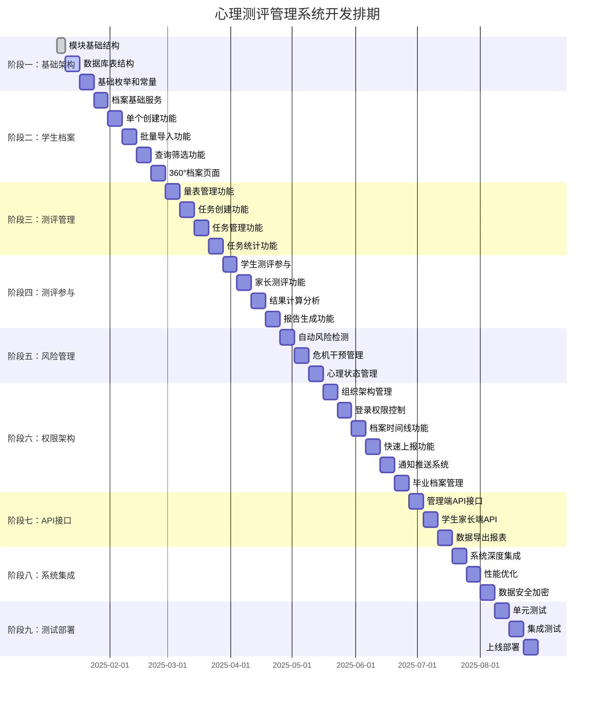

# 心理测评管理系统项目排期甘特图

## 项目概览

- **项目名称**：心理测评管理系统
- **开发周期**：预计16周（4个月）
- **团队规模**：建议3-4人（1个后端主力 + 1个前端 + 1个测试 + 1个产品/UI）
- **里程碑**：5个主要里程碑

## 甘特图

## 里程碑计划

### 🎯 里程碑1：基础架构完成（2025-01-24）
- **目标**：基础架构搭建完成，学生档案管理功能可用
- **交付物**：
  - 完整的模块结构
  - 数据库表结构
  - 基础枚举和常量
- **验收标准**：模块可以正常启动，数据库表创建成功

### 🎯 里程碑2：核心业务打通（2025-03-28）
- **目标**：测评创建和参与功能完成，核心业务流程打通
- **交付物**：
  - 学生档案管理功能
  - 测评任务创建和管理
  - 基础的测评参与流程
- **验收标准**：可以创建测评任务，学生可以参与测评

### 🎯 里程碑3：完整测评流程（2025-04-25）
- **目标**：完整的测评流程，包括结果分析和报告生成
- **交付物**：
  - 测评参与功能
  - 结果计算和分析
  - 报告生成功能
- **验收标准**：完整的测评流程可以正常运行

### 🎯 里程碑4：权限和管理功能（2025-06-27）
- **目标**：风险管理和权限控制完成，系统安全性达标
- **交付物**：
  - 风险检测和干预
  - 组织架构和权限管理
  - 时间线和快速上报
- **验收标准**：权限控制正常，风险管理功能可用

### 🎯 里程碑5：系统上线（2025-08-29）
- **目标**：测试完成，系统可以上线部署
- **交付物**：
  - 完整的API接口
  - 系统集成和优化
  - 测试报告和部署文档
- **验收标准**：系统通过所有测试，可以正式上线

## 关键路径分析

### 🔴 关键路径（不可延期）
1. **数据库表结构设计** → 影响所有后续开发
2. **学生档案管理** → 其他功能的基础数据
3. **测评任务创建** → 核心业务流程
4. **权限管理系统** → 影响所有功能的安全性
5. **API接口开发** → 前端开发的依赖

### 🟡 次要路径（可适当调整）
1. **报告生成功能** → 可以在后期优化
2. **通知推送系统** → 可以使用简单方案先上线
3. **数据导出功能** → 非核心功能，可后期补充

### 🟢 可并行开发
1. **前端页面开发** → 可与后端API开发并行
2. **单元测试编写** → 可与功能开发并行
3. **文档编写** → 可与开发并行进行

## 风险评估与应对

### 🚨 高风险项
1. **权限系统复杂度**
   - 风险：角色权限设计复杂，可能影响开发进度
   - 应对：提前进行详细设计，分阶段实现

2. **数据库性能**
   - 风险：大量学生数据可能影响查询性能
   - 应对：提前进行索引设计和查询优化

3. **第三方集成**
   - 风险：与现有系统集成可能遇到兼容性问题
   - 应对：提前进行技术调研和测试

### ⚠️ 中风险项
1. **固定问卷设计**
   - 风险：硬编码问卷可能不够灵活
   - 应对：设计良好的扩展接口，为二期做准备

2. **时间线功能**
   - 风险：不可删除的设计可能带来数据量问题
   - 应对：设计合理的数据归档策略

## 资源分配建议

### 👨‍💻 后端开发（2人）
- **主力开发**：负责核心业务逻辑和复杂功能
- **辅助开发**：负责基础功能和API接口

### 👩‍💻 前端开发（1人）
- 负责管理端和学生家长端的页面开发
- 与后端并行开发，通过Mock数据先行

### 🧪 测试工程师（1人）
- 编写测试用例和自动化测试
- 进行功能测试和性能测试

### 📋 产品经理（0.5人）
- 需求澄清和产品设计
- 用户验收和反馈收集

## 质量保证

### 📊 代码质量
- 代码覆盖率 > 80%
- 单元测试通过率 100%
- 代码审查覆盖率 100%

### 🔒 安全质量
- 权限控制测试通过
- 数据加密验证通过
- 安全漏洞扫描通过

### ⚡ 性能质量
- 接口响应时间 < 500ms
- 并发用户数 > 1000
- 数据库查询优化完成

## 交付标准

### 📦 代码交付
- 完整的源代码和文档
- 部署脚本和配置文件
- 数据库初始化脚本

### 📚 文档交付
- 系统设计文档
- API接口文档
- 用户操作手册
- 运维部署文档

### 🧪 测试交付
- 测试用例和测试报告
- 性能测试报告
- 安全测试报告